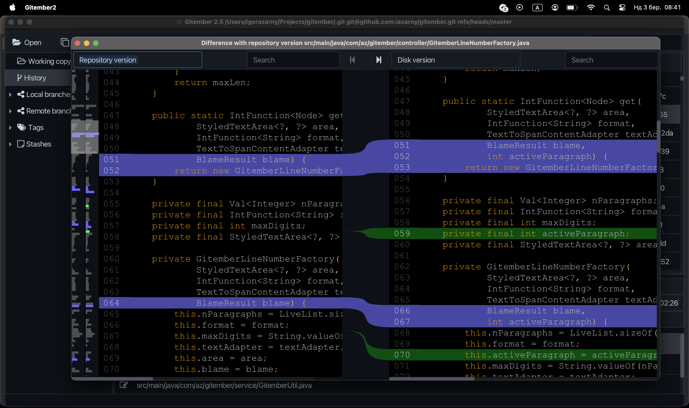
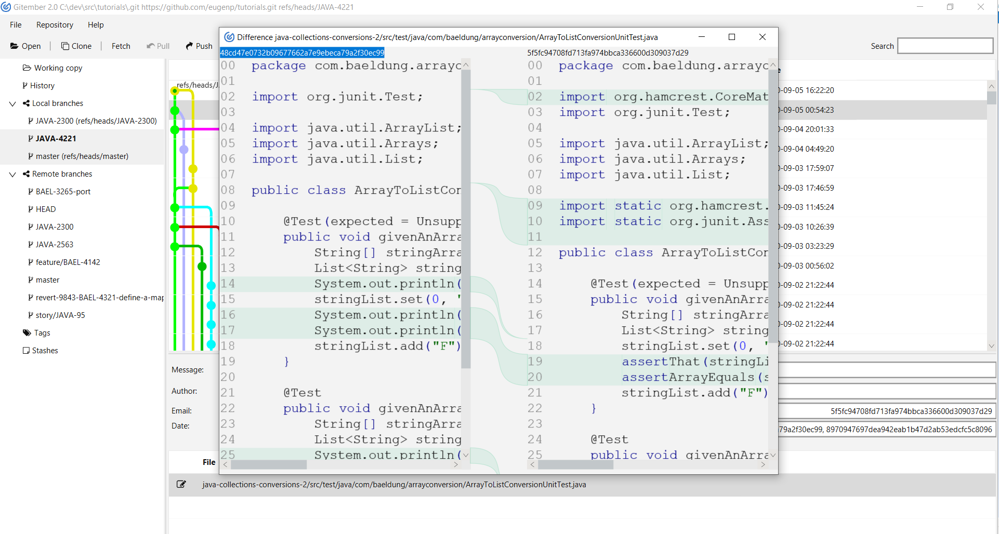

# Geetember 2.5
---
Has been renamed from Gitember. Just another GIT gui client just for fun. 

## Multiplatform GUI for GIT

For Linux, Windows and Mac

Downloads
 * [Windows](http://gitgui.org/Gitember2.5.msi)
 * [Mac M1](http://gitgui.org/Gitember2.5.dmg)
 

## Reasons to create 

Nothing in particular, but 
 * I had some free time in december 2016 and wanted to check is JavaFx suitable for GUI programming
 * I dont like standard UX of GIT
 * Check https://www.geetember.org/

## Changes

### 2.5 
 * Diff viewer has been updated
 * UI changes
 * Added support for Ed25519
 * Mac M1 silicon support

### 2.35
 * Minor changes , related to search 
 * Open files from stash 
 * Add chery pick 
 * Rename to geetember 

### 2.3
 * Full text search across history, including binary files
 * Search in open files
 * Add change annotation
 * Branch differences with item details
 * Add overview for difference component 

### 2.2
 * Added LFS support. With SSH only. Http is coming soon see  https://www.eclipse.org/lists/jgit-dev/msg03804.html for details
 * Fast file compare. The text flow changed to rich text fx .
 * Mass operations - delete, stage, unstage, revert
 * Branch difference

 

## Plans 

 * Integration with git providers, at least with github
 * Tabs support

