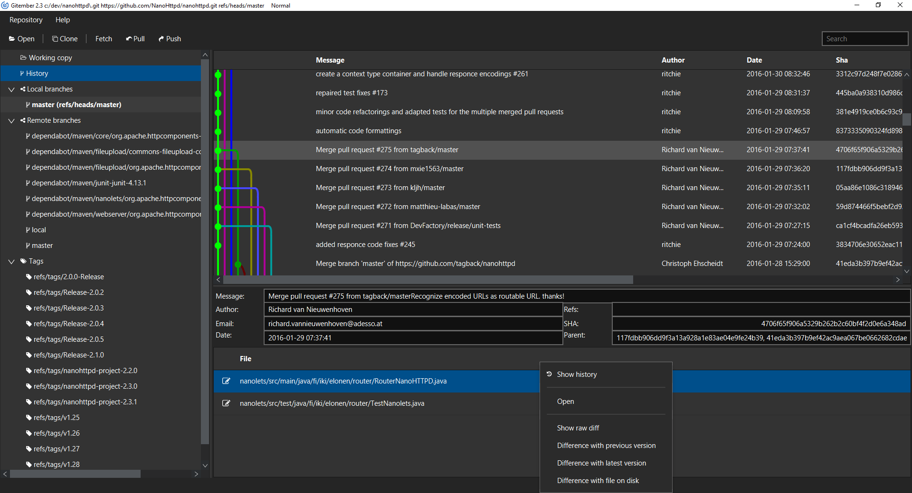

# Gitember 2
---
November, December, Gitember. Just another GIT gui client just for fun. 

## Multiplatform GUI for GIT

For Linux, Windows and Mac

## Reasons to create 

Nothing in particular, but 
 * I had some free time in december 2016 and wanted to check is JavaFx suitable for GUI programming
 * I dont like standard UX of GIT
 * Check https://www.gitgui.org/

## Plans 

 * Mac M1 support

