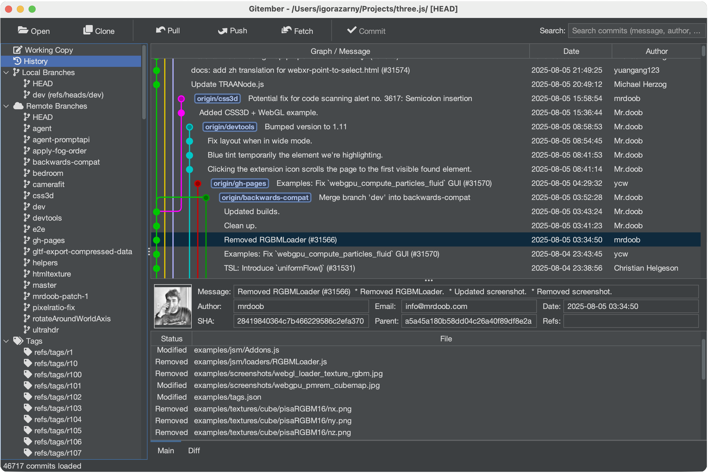

# Gitember v 3
---
A free, open-source Git GUI client for Linux, Windows, and macOS. Fast, lightweight, and packed with features that make everyday Git work a pleasure.

> **What's new in v3:** The GUI has been completely rewritten, replacing the heavy JavaFX runtime. 
> The result is a significantly smaller download, faster startup, and lower memory 
> usage — while adding first-class integrations with **GitHub, GitLab, Bitbucket, and Gitea**.
> JavaFX version still available in the branch or by tag

## Why Gitember?

* **No command-line memorisation** — commit, branch, merge, stash, rebase through a clean visual interface
* **Powerful diff viewer** — unified, context, and side-by-side modes with syntax highlighting for 40+ languages
* **Folder comparison tool** — compare entire directory trees and spot added / removed / changed files at a glance
* **Arbitrary file comparison tool** 
* **Pull Request review** — browse and review PRs from GitHub, GitLab, Bitbucket, and self-hosted Gitea without leaving the app
* **Advanced full-text search** — search commits, file contents, Office documents, PDFs, images, and CAD files across the entire history
* **Repository statistics** — commit frequency, lines changed per author, branch activity
* **Git LFS support** — manage large binary assets with built-in LFS tooling
* **Truly free** — open source, no account required, works offline

## Downloads — Version 3.0 · March 2026

| Platform         | Link                                                                               |
|------------------|------------------------------------------------------------------------------------|
| Windows (x64)    | [Gitember-3.0.msi](https://gitember.org/Gitember-3.0.msi) or from Microsoft store https://apps.microsoft.com/detail/9NXNMLLGBGD4 |
| macOS (M1)       | [Gitember-3.0.msi](https://gitember.org/Gitember-3.0.dmg)                          | 
| Linux  (x64)     | [Gitember-3.0.deb](https://gitember.org/Gitember-3.0.deb)                          | 
| Fat jar. java 21 | [Gitember-3.0.jar](https://gitember.org/Gitember-3.0.jar)                          | 

More info and documentation: https://gitember.org

## Changes

### 3.1 · April 2026

**GitHub,
integration**

### 3.0 · March 2026
* **GUI migrated from JavaFX to Swing** — dramatically faster startup, smaller install, lower memory footprint
* **GitHub, GitLab, Bitbucket, Gitea integration** — browse and review Pull Requests directly inside Gitember, avatars, token support
* Improved rendering performance across all platforms
* Reduced installer size

### 2.5.8
* Add ability to compare arbitrary files
* Small bugfixes

### 2.5.5
* Initial revision of docs added
* Small bugfixes

### 2.5.4
* Fix multi-monitor issues
* Adjust look and feel
* Minor refactoring

### 2.5.3
* Significant UI / UX changes

### 2.5
* Diff viewer updated
* UI changes
* Added support for Ed25519
* Mac M1 Silicon support

### 2.35
* Minor changes related to search
* Open files from stash
* Add cherry-pick
* Renamed to Geetember

### 2.3
* Full-text search across history, including binary files
* Search in open files
* Add change annotation
* Branch differences with item details
* Add overview for difference component

### 2.2
* Added LFS support (SSH only)
* Fast file compare using RichTextFX
* Mass operations — delete, stage, unstage, revert
* Branch difference view

## Background

Started in December 2016 as a weekend experiment to see if JavaFX was suitable for desktop GUI programming. It turned into a full-featured Git client. Version 3 marks the move to Swing for a lighter, faster experience.

hGTwerg#4%fwerfFGWGT%TG