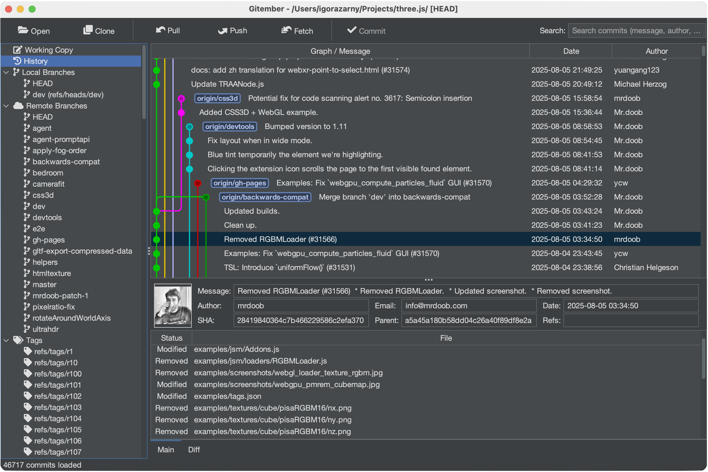

# Gitember v 3
---
A free, open-source Git GUI client for Linux, Windows, and macOS. Fast, lightweight, and packed with features that make everyday Git work a pleasure.




## Why Gitember?

* **Workspace** — groups several independent repositories to pull, push, commit, branch and merge across all of them in one action. And more
* **AI features** — secret leak detection, commit message generation, branch description
* **No command-line memorization** — commit, branch, merge, stash, rebase through a clean visual interface
* **Powerful diff viewer** — unified, context, and side-by-side modes with syntax highlighting for 40+ languages
* **Folder comparison tool** — compare entire directory trees and spot added / removed / changed files at a glance
* **Arbitrary file comparison tool** 
* **Interactive rebase** 
* **3-way conflict resolution** 
* **Pull Request review** — browse and review PRs from GitHub, GitLab, Bitbucket, and self-hosted Gitea without leaving the app
* **Advanced full-text search** — search commits, file contents, Office documents, PDFs, images, and CAD files across the entire history
* **Repository statistics** — commit frequency, lines changed per author, branch activity
* **Git LFS support** — manage large binary assets with built-in LFS tooling
* **Truly free** — open source, no account required, works offline

## Downloads — Version 3.4 Aug 2026

| Platform         | Link                                                                                                                                                                                                       |
|------------------|------------------------------------------------------------------------------------------------------------------------------------------------------------------------------------------------------------|
| Windows (x64)    | MSI [Gitember-3.4.msi](https://gitember.org/Gitember-3.4.msi) <br/>Microsoft store https://apps.microsoft.com/detail/9NXNMLLGBGD4 <br/> Portable [Gitember-3.4.zip](https://gitember.org/Gitember-3.4.zip) |
| macOS (M1)       | [Gitember-3.4.dmg](https://gitember.org/Gitember-3.4.dmg)                                                                                                                                                  | 
| Linux  (x64)     | [Gitember-3.4.deb](https://gitember.org/Gitember-3.4.deb)                                                                                                                                                  | 
| Fat jar. java 21 | [Gitember-3.4.jar](https://gitember.org/Gitember-3.4.jar)                                                                                                                                                  | 


More info and documentation: https://gitember.org

## Building from Source

**Requirements:** Java 21, Maven 3.x

```bash
# Clone the repository
git clone https://github.com/iazarny/gitember.git
cd gitember

# Build (skip tests)
mvn package -DskipTests

# Build and run tests
mvn package

# Run directly via Maven
mvn exec:java

# Run a single test class
mvn test -Dtest=GitRepoServiceTest

# Produce the runnable fat jar
mvn package -DskipTests
java -jar target/gitember-3.4-SNAPSHOT-boot.jar
```

## Changes

### 3.4 · Sep 2026

A **Workspace** groups several Git repositories together so you can manage them as a single
unit — handy when a project is split across multiple repos , for example:
- a backend and frontend
- a set of microservices
- a SPI and set of implementation


  and you want to pull, push, commit, or just see the status of all of them
  without opening each repository separately.


### 3.3 · Jun 2026

The changes in this revision  focus on improving the usability and functionality of Gitember, a Git desktop client. Notable updates include:

* Improvements to interactive rebase, AI-assisted writing, and three-way merge conflict resolver
* Full UI support for worktrees with correct status and diff display
* Enhanced GitHub/GitLab/Bitbucket/Gitea integration with optional AI-powered commit message generation

* **Interactive rebase** improvements
* AI (experimental)
  * Commit message generation 
  * Change default model from llama3.2 to qwen2.5-coder
* Security fixes
  * Verify ollama checksum after installation
  * Integrate Java Keyring with CipherService for OS keychain integration
  * Do not disable TLS certificate verification

### 3.2 · May 2026

* Added 3 way merge for conflict resolving 
* Worktree support
* AI (experimental)
  * Secret leak detection
  * Branch difference description

### 3.1 · April 2026

* **Interactive rebase** has beed added
* Secret leak detection (experimental)
* Author and Commiter overwrite 
* Speedup statistics up to 3 times 
* Small bug fixes

### 3.0 · March 2026
* **GUI migrated from JavaFX to Swing** — dramatically faster startup, smaller install, lower memory footprint
* **GitHub, GitLab, Bitbucket, Gitea integration** — browse and review Pull Requests directly inside Gitember, avatars, token support
* Improved rendering performance across all platforms
* Reduced installer size

### 2.x.x
The Fx version available by tags

