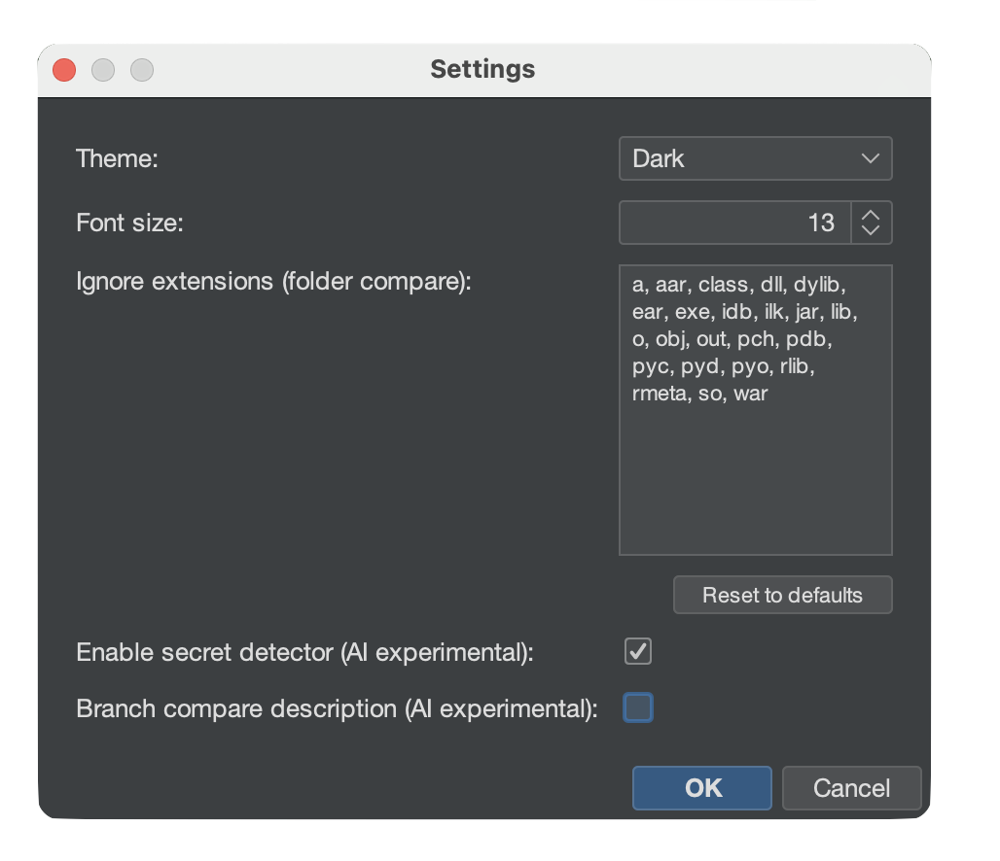
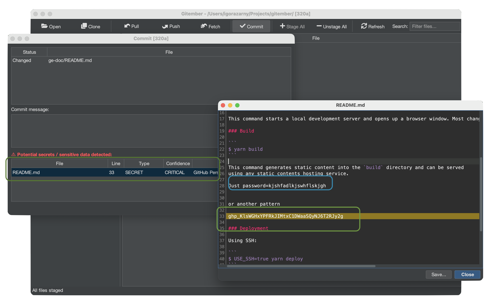
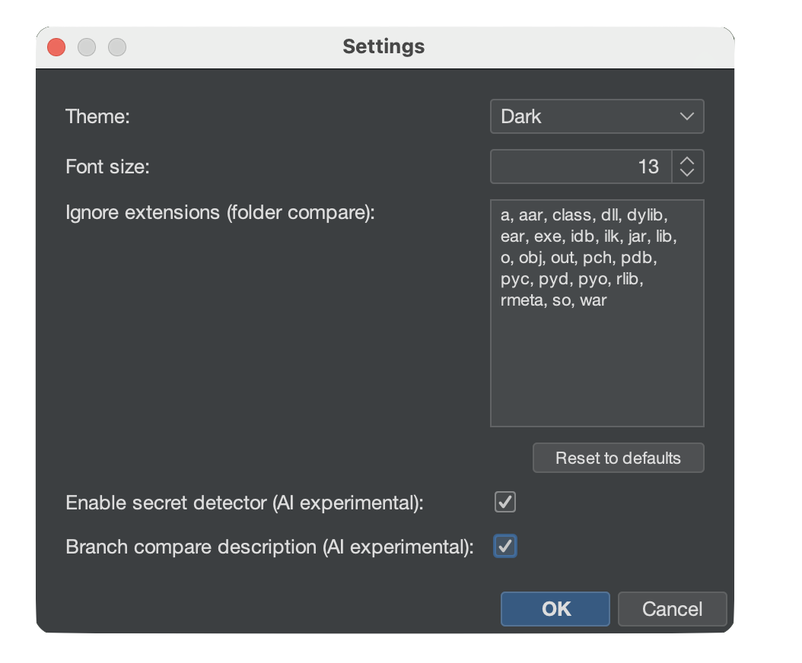
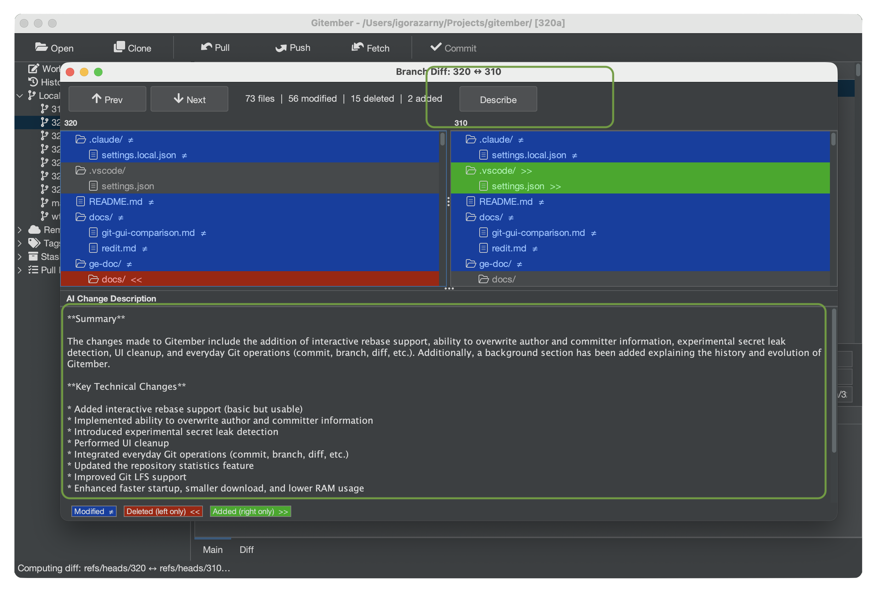

# Experimental AI Features

Gitember includes two opt-in AI features powered by a **locally-running** language model
via [Ollama](https://ollama.com). No data is sent to any cloud service — all inference
runs on your own machine.

> These features are under active development. Results depend on the model you choose and
may occasionally produce false positives or incomplete output.

## Requirements

Both features share the same prerequisite: **Ollama** must be installed and a model must
be available locally.

When you enable either feature in Settings for the first time, Gitember detects whether
Ollama is present and offers to **download and install it automatically** if it is not.

Configure the Ollama URL and model name in **File → Settings → AI**.

---

## Secret Leak Detection

Gitember scans staged files for hardcoded secrets, credentials, and other sensitive data
**before each commit**, giving you a chance to remove them before they enter history.

### Enabling

1. Open **File → Settings**.
2. Check **Enable secret detector (AI experimental)**.
3. Click **OK**.

### How It Works

When you open the **Commit** dialog, the detector scans every staged file and reports
any suspicious findings in a panel above the commit message field.

Each finding shows:

| Field | Description |
|-------|-------------|
| File | Source file that contains the finding. |
| Line | Line number of the suspicious value. |
| Type | Category: `SECRET`, `TOKEN`, `API_KEY`, `PASSWORD`, `CREDENTIAL`, `CONNECTION_STRING`. |
| Confidence | `CRITICAL`, `HIGH`, `MEDIUM`, or `LOW`. |
| Description | Short explanation of why the value was flagged. |
| Matched value | Partially redacted preview (first 4 characters + `***`). |

Only **CRITICAL** confidence findings block your attention by default — lower-confidence
results are still shown but do not prevent committing.

### What Is Detected

The scanner flags values that match at least one of the following:

- A hardcoded string assigned to a variable with a sensitive name
  (`password`, `secret`, `token`, `api_key`, `client_secret`, …)
- A connection string with embedded credentials (`user:pass@`, `password=`, `pwd=`)
- Private key or certificate material (`BEGIN PRIVATE KEY`, …)
- OAuth client secrets or bearer tokens in explicit assignments
- High-entropy strings (length ≥ 20, mixed characters) in assignments or HTTP headers

### What Is Not Detected

Placeholders, test values, environment variable references, UUIDs, and short strings
are intentionally ignored to keep the false-positive rate low.

---

## AI Branch Difference Description

When comparing two branches, Gitember can ask the local LLM to produce a plain-English
summary of what changed — useful for code reviews and release notes.

### Enabling

1. Open **File → Settings**.
2. Check **Branch compare description (AI experimental)**.
3. Click **OK**.

### How It Works

Open the **Branch Diff** view (**Repository → Compare Branches…** or via the branch
context menu). Once the diff is loaded, click the **Describe with AI** button.

Gitember sends the unified diff (up to ~12 000 characters) to the local Ollama model
and displays the result in a panel below the diff, structured as:

1. **Summary** — 2–4 sentences describing what changed at a high level and why.
2. **Key technical changes** — bullet list of important logic, API, data-model,
   configuration, or dependency changes (up to 10 items).
3. **Potential impact** — breaking changes, performance notes, security considerations,
   or migration steps (omitted when there is no notable impact).

Large diffs are automatically truncated before being sent to avoid exceeding the model's
context window.

---

## Choosing an Ollama Model

The quality and speed of AI features depends on the model. Recommended starting points:

| Model | Size | Notes                                                        |
|-------|------|--------------------------------------------------------------|
| `llama3.2` | ~2 GB | Good balance of quality and speed on most hardware.  Default |
| `mistral` | ~4 GB | Strong reasoning; better for complex diffs. Planned          |
| `phi3` | ~2 GB | Lightweight; fast on CPU-only machines.       Planned        |

Run `ollama pull <model-name>` in a terminal to download a model, then set the model
name in **File → Settings → AI**.
