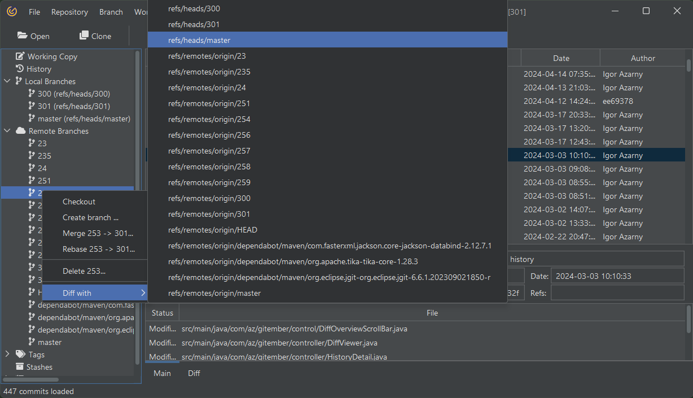
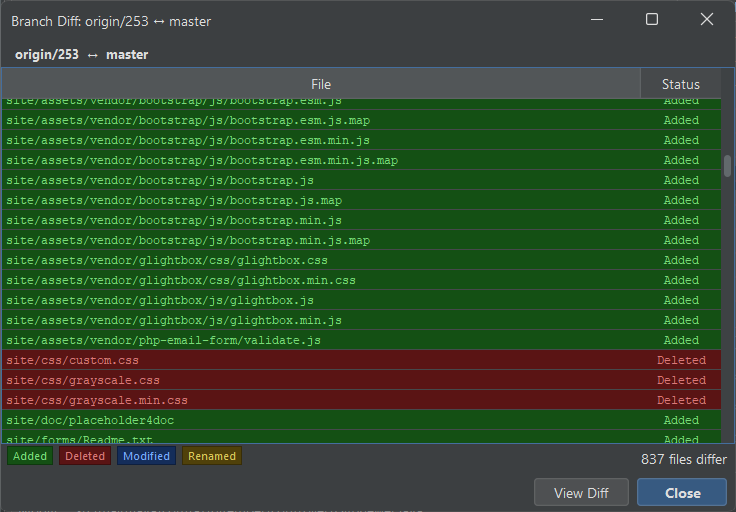

# Branch differences

Being able to see the differences between two branches is crucial for understanding what changes have been 
made and how branches diverge. Gitember provides a user-friendly way to compare branches. 

To see difference betwnn branches just use context menu on the branch and select "Compare with" option.

As result you will see the differences between branches in the diff view.

Just double click or use context on the file to open it in the editor and see the changes.
