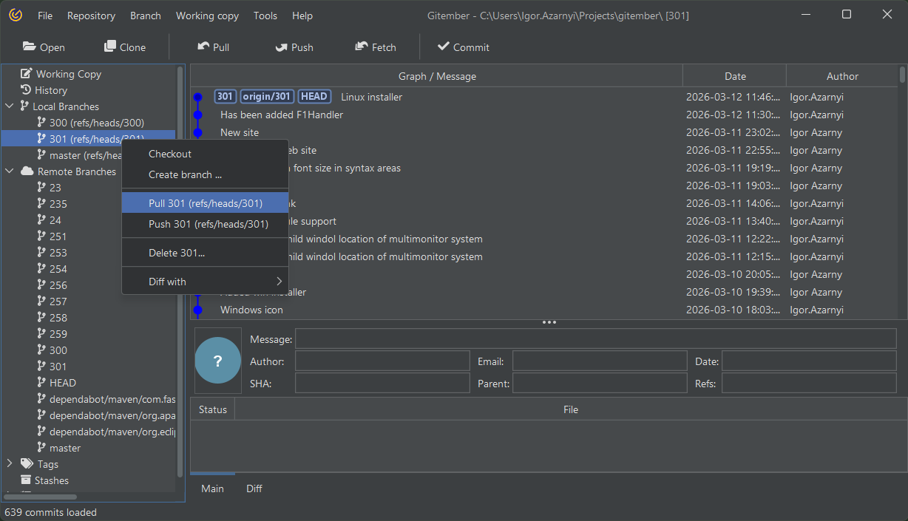
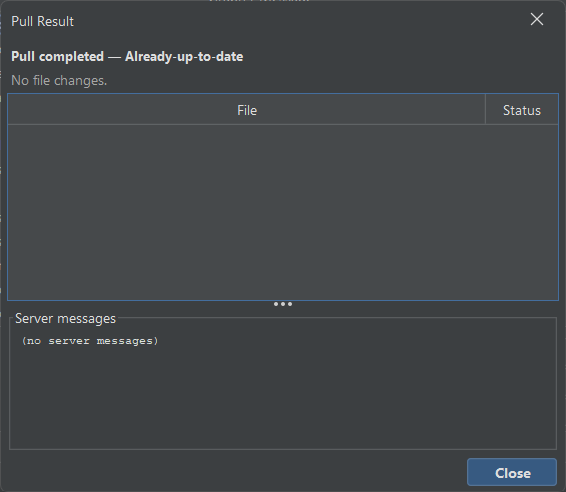

# Pull branch

Pulling a branch with Gitember allows you to update your local repository 
with changes from the remote repository. This ensures that you are 
working with the most recent version of the branch, which is essential for collaboration 
and avoiding conflicts. 

Ensure You Are on the Correct Branch. Make sure you have checked out the 
branch you want to update. If not, select the branch and click Checkout from the context menu.

With the branch checked out, click on the Pull button in the 'Branch' tab or use branch context menu.

Gitember will fetch the latest changes from the remote repository and merge them into your local branch.

## Pulling a Branch with No Conflicts.

Working branch will be updated with changes from remote branch 
and you will see the result in the history view.

See also [Pulling Changes](https://git-scm.com/book/en/v2/Git-Branching-Basic-Branching-and-Merging) in Git documentation.

