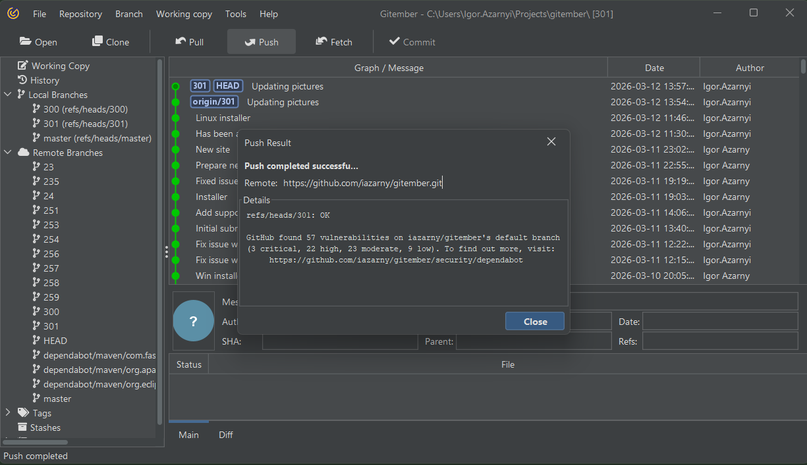
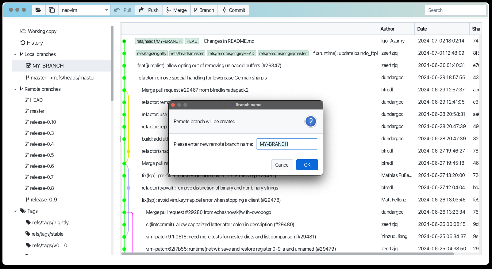
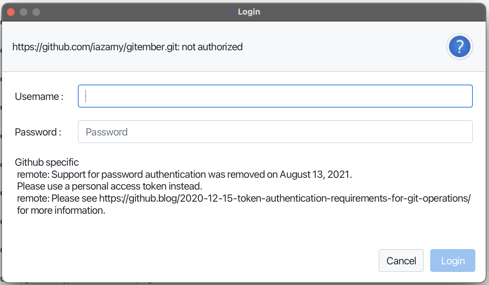

# Push branch

When changes were commited into local branch and you want to share them with others, 
you need to push the branch to the remote repository.

To push a branch in Gitember,  just right click (win) or ctrl click (mac) on ranch, which you want to 
push and select pusk from context menu. The same you can do from tool bar or from menu Branch -> Push.

In case if branch was not tracked in remote repo you will be prompted for remote branch name, otherwise branch will be simple pushed to remote repo.

## Error handling

During push operation some errors may occur:
 * Authorization issue
 * Connection errors
 * Etc 

In case with authorization you will be prompted to input login and password. This operation need to do once.
Login and password will be remembered

## Push result 

Result of the operation will be shown in the dialog

See also [Pushing Changes](https://git-scm.com/book/en/v2/Git-Branching-Basic-Branching-and-Merging) in Git documentation.
