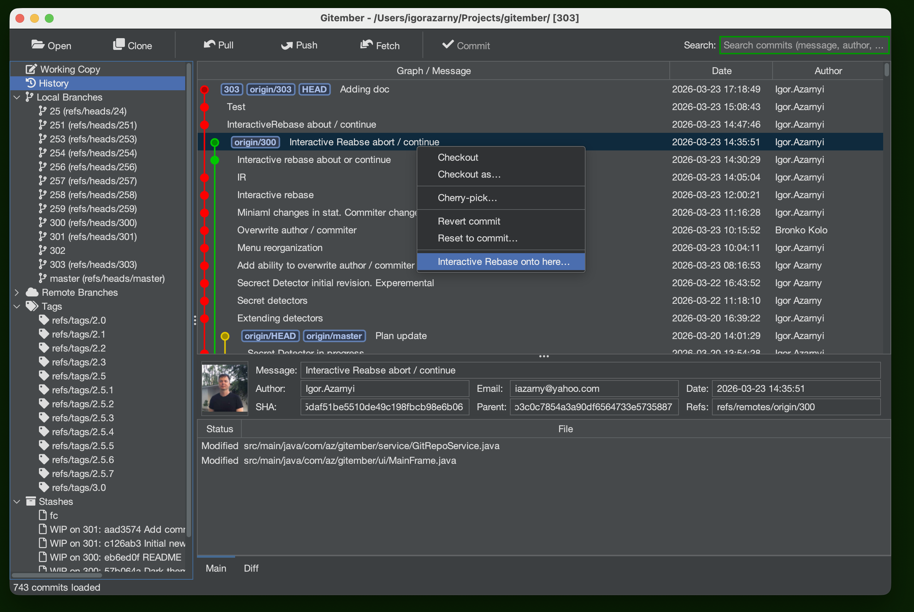
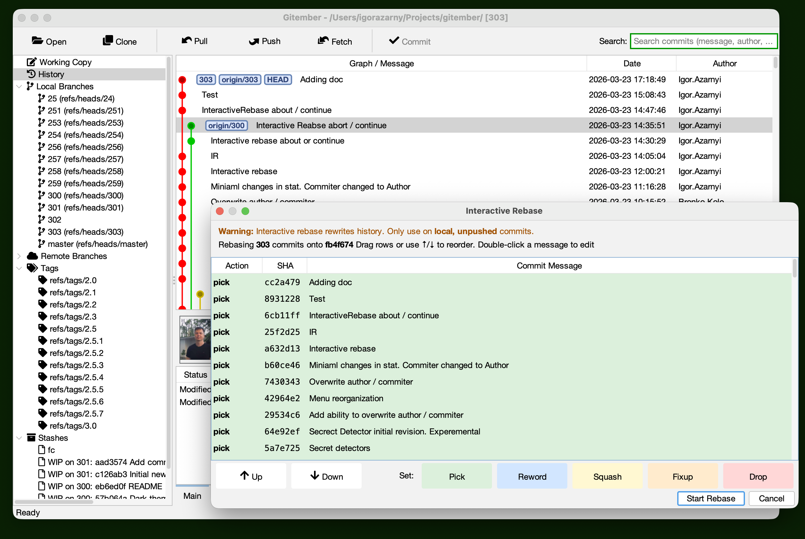
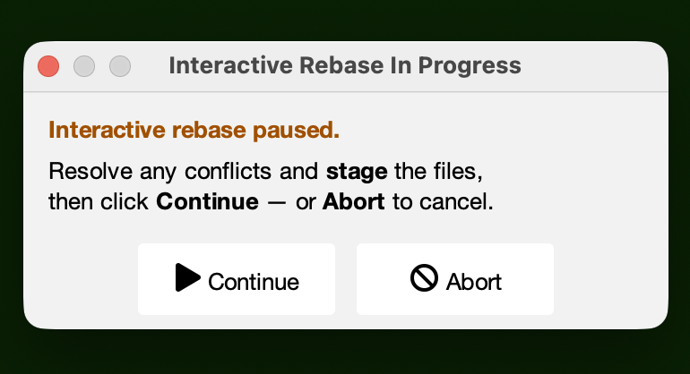

# Interactive Rebase

Interactive rebase gives you fine-grained control over the commit history of a branch. You can reorder commits, rewrite messages, squash several commits into one, or drop commits entirely — all before the branch is shared with others.

See also [Rewriting History](https://git-scm.com/book/en/v2/Git-Tools-Rewriting-History) in Git documentation.

:::caution
Interactive rebase rewrites commit history. Never rebase commits that have already been pushed to a shared remote branch, as it will cause divergence for other contributors.
:::

## Starting an Interactive Rebase

There are two ways to start an interactive rebase:

**From the History view (recommended):**

1. Open the **History** view.
2. Right-click the commit you want to use as the *base* — all commits above it up to HEAD will be included in the rebase plan.
3. Select **Interactive Rebase onto here…**.

**From the Branch menu:**

1. Open the **Branch** menu in the main menu bar.
2. Select **Interactive Rebase…**.
3. Enter or paste the SHA of the base commit.

## The Interactive Rebase Dialog

After Gitember loads the commits, the **Interactive Rebase** dialog opens showing a table of commits to be rebased.

The table contains one row per commit, listed newest-first. Each row has three columns:

| Column | Description |
|--------|-------------|
| **Action** | Drop-down to choose what to do with this commit (see below). |
| **SHA** | Abbreviated commit identifier (read-only). |
| **Message** | Commit message — editable when the action is **Reword**. |

### Rebase Actions

| Action | Effect |
|--------|--------|
| **Pick** | Keep the commit as-is (default). |
| **Reword** | Keep the commit's changes but use the message you type in the Message column. |
| **Squash** | Fold this commit into the one above it; combine both commit messages. |
| **Fixup** | Like Squash, but discard this commit's message and keep only the previous one. |
| **Drop** | Remove this commit from history entirely. |

### Reordering Commits

To change the order in which commits are applied:

* Select a row and click the **▲ Up** or **▼ Down** buttons on the right side of the dialog.
* Alternatively, drag a row to the desired position using drag-and-drop.

The commit at the bottom of the list will be applied first (oldest), and the commit at the top will be applied last (newest).

### Row Colours

Each action is colour-coded for quick identification:

| Colour | Action |
|--------|--------|
| Green  | Pick |
| Blue   | Reword |
| Yellow | Squash |
| Orange | Fixup |
| Red    | Drop |

## Running the Rebase

Click **OK** to confirm the plan and start the rebase. Gitember applies the commits in the background and reports the result in the status bar.

If the rebase completes without conflicts, the history panel refreshes automatically to show the rewritten history.

## Handling Conflicts During Rebase

If a commit cannot be applied cleanly, the rebase pauses and a floating **Interactive Rebase In Progress** dialog appears.

The dialog lists all files with conflicts and stays on top of the main window so you can resolve conflicts while it is visible.

### Resolving Conflicts

1. Open each conflicted file listed in the dialog.
2. Edit the file to resolve the conflict markers (`<<<<<<<`, `=======`, `>>>>>>>`).
3. Stage the resolved file via the **Working Copy** page (check the checkbox next to the file).
4. Click **Continue** in the floating dialog.

Gitember runs command similar to original `git rebase --continue`. If further commits also conflict, 
the dialog reappears with the new conflict list.

### Aborting the Rebase

Click **Abort** in the floating dialog to cancel the entire rebase. Gitember runs `git rebase --abort` and restores the branch to the state it was in before the rebase started.

## Resuming After a Restart

If Gitember is closed while a rebase is paused, the **Interactive Rebase In Progress** dialog reappears automatically the next time the repository is opened, allowing you to continue or abort where you left off.

## Summary

| Step | Action |
|------|--------|
| Start | History → right-click commit → **Interactive Rebase onto here…** |
| Edit plan | Set actions (Pick/Reword/Squash/Fixup/Drop), reorder rows |
| Run | Click **OK** in the dialog |
| On conflict | Resolve files → stage → click **Continue** |
| Cancel | Click **Abort** in the floating dialog |
