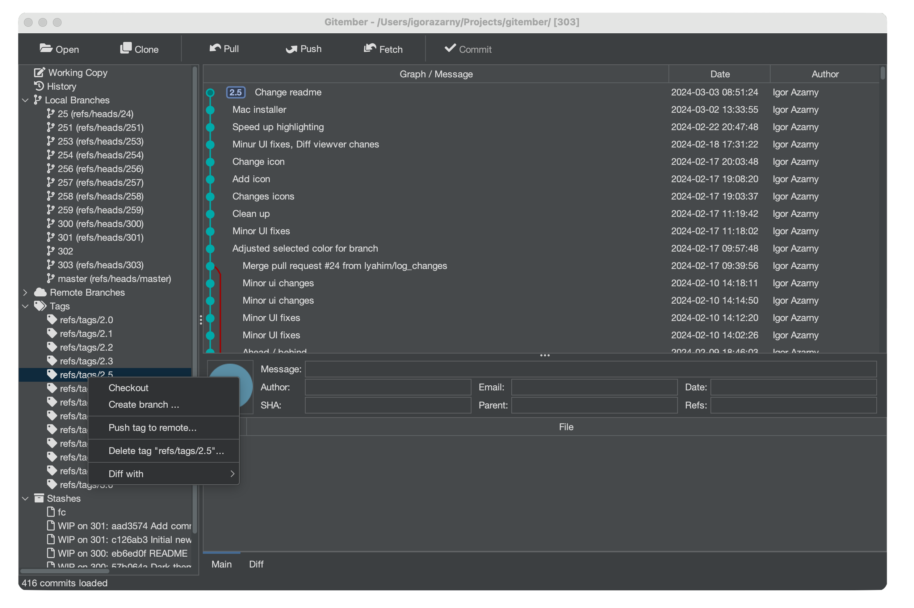
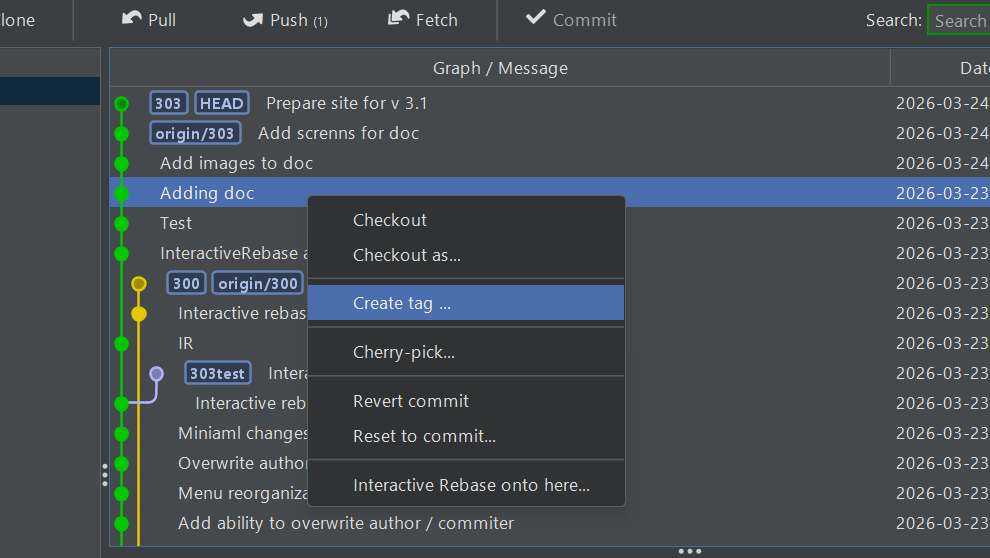

# Tags

Tags are named references that point to specific commits, commonly used to mark release points (e.g. `v1.0`, `v2.3.1`). Unlike branches, tags do not move as new commits are added.

See also [Git Tagging](https://git-scm.com/book/en/v2/Git-Basics-Tagging) in Git documentation.

## Viewing Tags

Tags are displayed in the **Branches** panel alongside local and remote branches, grouped under the **Tags** section.

Clicking a tag navigates the History view to the commit the tag points to.

## Creating a Tag

To tag the current HEAD commit:

1. Open the **Branches** panel.
2. Click the **Create Tag** button in the toolbar, or right-click in the Tags section and choose **Create Tag**.
3. Enter a tag name in the dialog (e.g. `v1.0`).
4. Click **OK**.

Gitember creates an annotated tag on the current HEAD.

:::tip
Tag names follow the same rules as branch names — no spaces, no special characters other than `-`, `_`, and `.`.
:::

To tag a specific commit rather than HEAD:

1. Open the **History** view.
2. Right-click the target commit.
3. Select **Create Tag** from the context menu.

## Deleting a Local Tag

To remove a tag from your local repository:

1. In the **Branches** panel, right-click the tag you want to remove.
2. Select **Delete Tag**.

:::caution
Deleting a local tag does not remove it from the remote repository. Use **Delete Remote Tag** to remove a tag from the remote.
:::

## Pushing a Tag to Remote

To share a tag with others by pushing it to the remote repository:

1. Right-click the tag in the **Branches** panel.
2. Select **Push Tag**.

The tag is pushed to `origin` using the same credentials configured for the repository.

## Deleting a Remote Tag

To remove a tag from the remote repository (without affecting the local tag):

1. Right-click the tag in the **Branches** panel.
2. Select **Delete Remote Tag**.

A force-delete ref spec is sent to the remote, removing the tag there while keeping your local copy intact.

## Summary

| Action | How to trigger |
|--------|---------------|
| View tags | Branches panel → **Tags** section |
| Create tag on HEAD | Branches panel toolbar → **Create Tag** |
| Create tag on a commit | History view → right-click commit → **Create Tag** |
| Delete local tag | Branches panel → right-click tag → **Delete Tag** |
| Push tag to remote | Branches panel → right-click tag → **Push Tag** |
| Delete remote tag | Branches panel → right-click tag → **Delete Remote Tag** |
