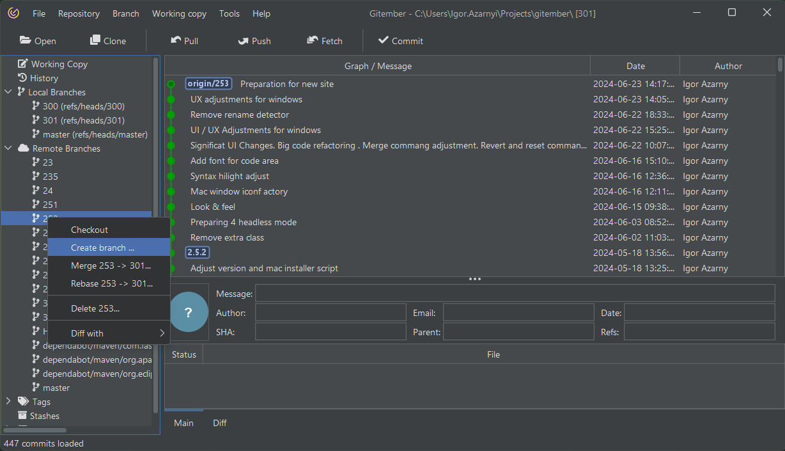
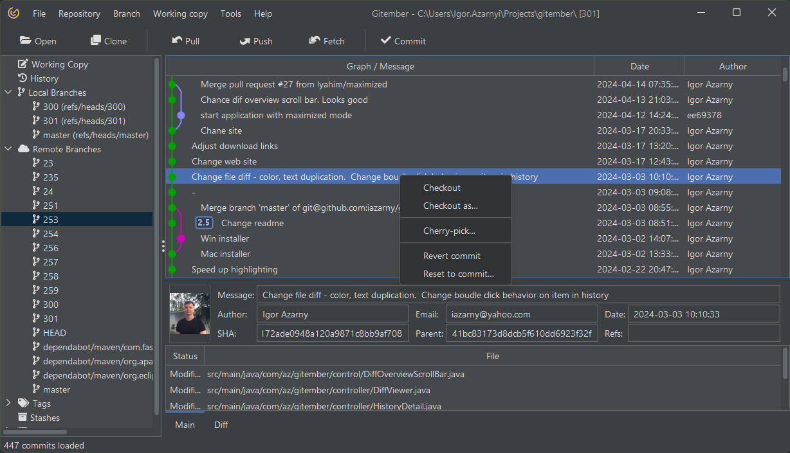
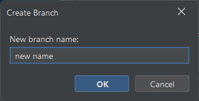
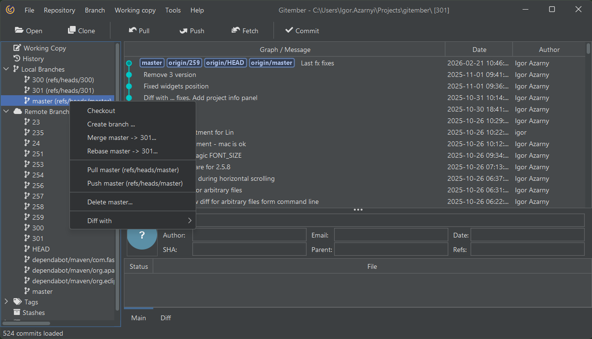

# Working with Local and Remote Branches in Gitember

Gitember simplifies the process of managing both local and remote branches, 
making it easy to perform various Git operations through its intuitive interface. 
Below are detailed steps and explanations for common tasks such as forking, 
pulling, pushing, committing, rebasing, checking out, and fetching.

## Creating a New Branch

Creating a new branch allows you to work on a specific feature or fix independently from the main branch.
To create a new branch in Gitember, follow these steps:
 * Go to the Local or Remote branches tab on the left side bar.
 * Select parent branch 
 * Right click (Win) or Ctrl click (Mac) on the selected branch and choose "Create Branch" from the context menu. Provide name in the dialog and press Ok
 * The same you can do for remote branches or any commit in the history view.

|Local or Remote  | History                              |
|-----------------|--------------------------------------|
||  |

## Mark branch as current
New branch or some other branch can be marked as current. Just Right click (Win) or Ctrl click (Mac) on branch,
which you want to mark as current and choose "Checkout" from the context menu.

So all changes, which you make in the working copy will be made in the current branch. 
And you can commit them to the current branch. See [Working copy](../ge-wcopy/wcopy.md) for more details.

See also [Creating a Branch](https://git-scm.com/book/en/v2/Git-Branching-Basic-Branching-and-Merging) in Git documentation.