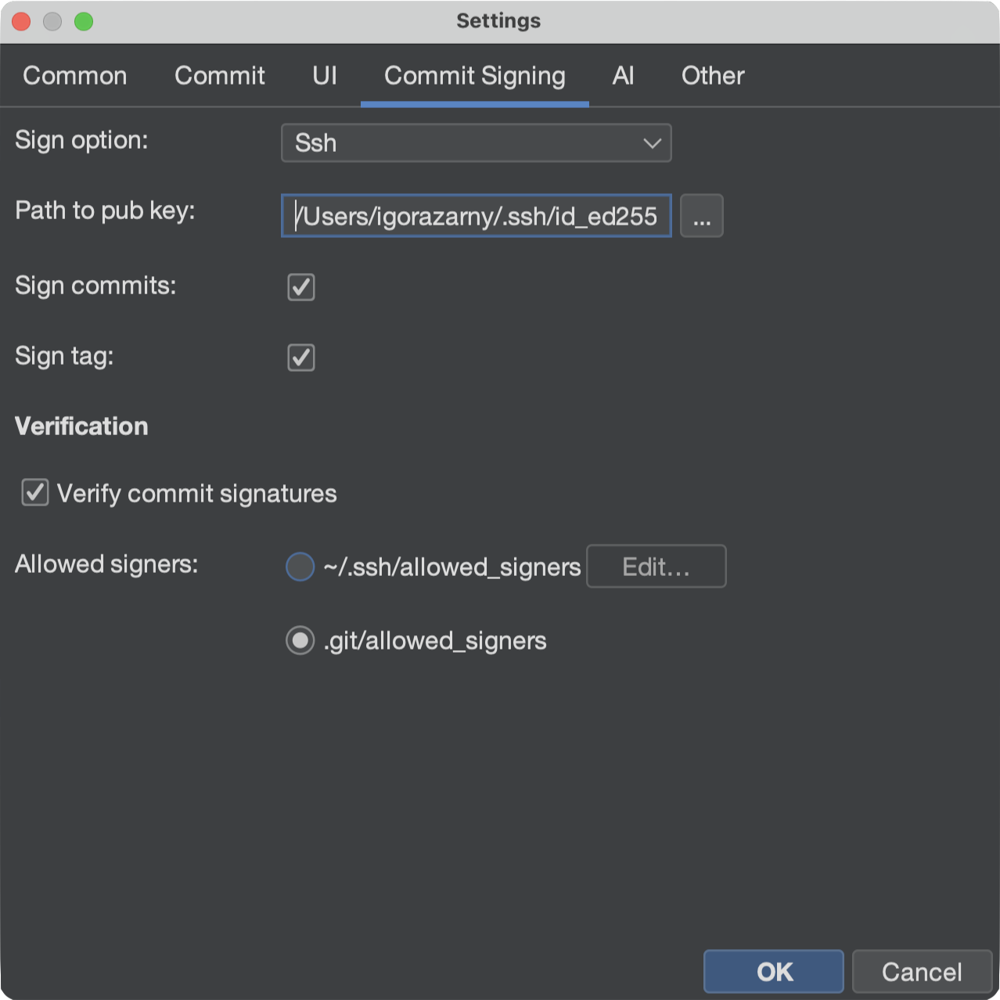
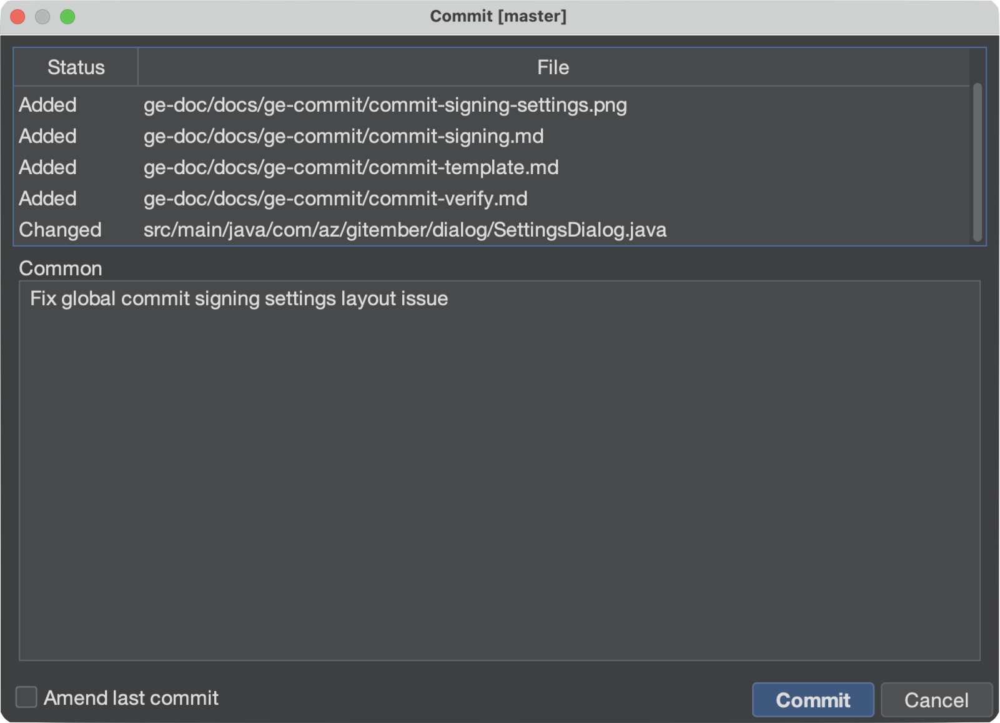

# Signing commits

Gitember can sign new commits and tags with **SSH** or **OpenPGP (GPG)**. Signing is configured
once in global settings and then applied when you commit or create a tag.

See also [Git commit signature verification](https://git-scm.com/book/en/v2/Git-Tools-Signing-Your-Work)
in the Git documentation.

## Enabling signing

1. Open **File → Settings**.
2. Open the **Commit Signing** tab.
3. Choose a **Sign option**:
   - **None** — do not sign (default).
   - **Ssh** — SSH signatures (`gpg.format=ssh`).
   - **Pgp** — OpenPGP signatures (`gpg.format=openpgp`).
4. Fill in the key field:
   - SSH: **Path to pub key** — the public key file used as `user.signingkey` (for example
     `~/.ssh/id_ed25519.pub`). The matching private key, or an SSH agent that holds it, must
     be available when you commit.
   - PGP: **Signing key** — the OpenPGP key id (for example `A7512BA8`).
5. Turn on **Sign commits** and/or **Sign tag** as needed.
6. Click **OK**.

Signing and [signature verification](commit-verify.md) are independent. You can sign your own
commits without turning verification on, and you can verify other people's commits without
signing yours.

## Creating a signed commit

Stage files as usual, then commit (**Commit** on the toolbar, or **Repository → Commit …**).
When **Sign commits** is on, Gitember sets `gpg.format` and `user.signingkey` on the repository
and asks JGit to sign the commit.

After the commit, History shows a key icon next to the author on signed commits. The commit
detail panel also shows a **Signature** row. Checking whether that signature is *trusted* is
a separate step — see [Verifying signatures](commit-verify.md).

## Signing tags

When **Sign tag** is on, annotated tags created from History or the Branches panel are signed
with the same key.

## SSH vs PGP

| | SSH | PGP |
|---|---|---|
| Typical key file | `~/.ssh/id_ed25519.pub` (and the private key / agent) | GPG keyring |
| Settings field | Path to the **public** key file | Key id |
| Who can verify it | People who list your key in an `allowed_signers` file | People who have your public key in their GPG keyring |

For SSH, the file you pick in Settings is a normal `*.pub` key file. That format is **not**
the same as a line in `allowed_signers` — see
[Allowed signers file format](commit-verify.md#allowed-signers-file-format).
