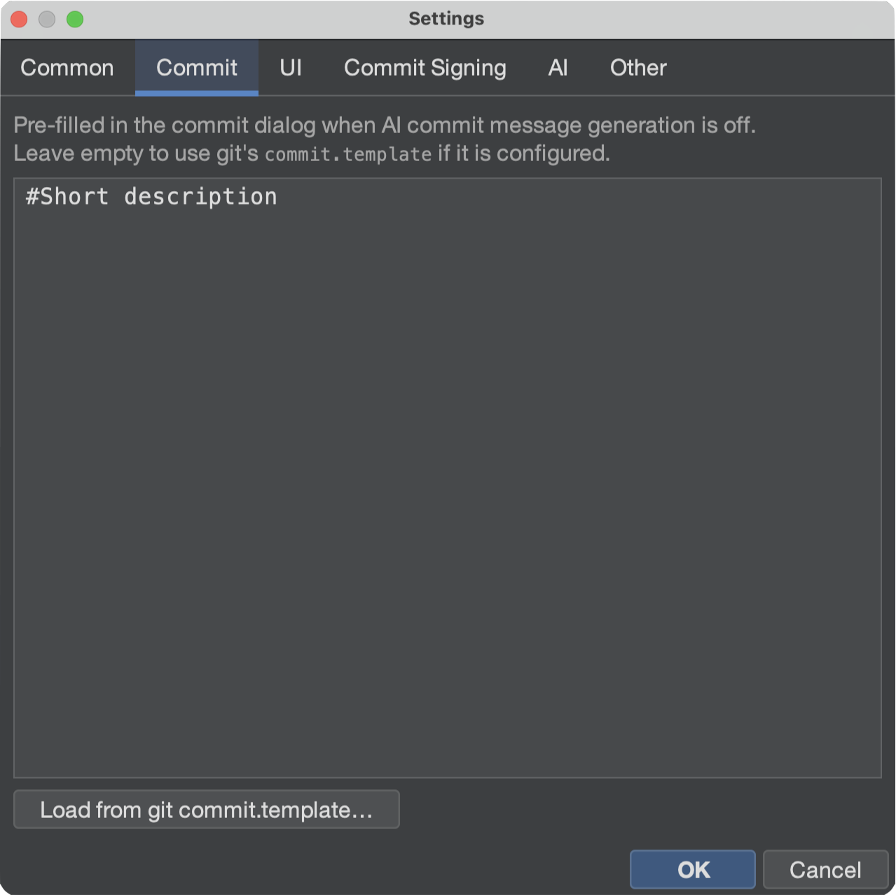
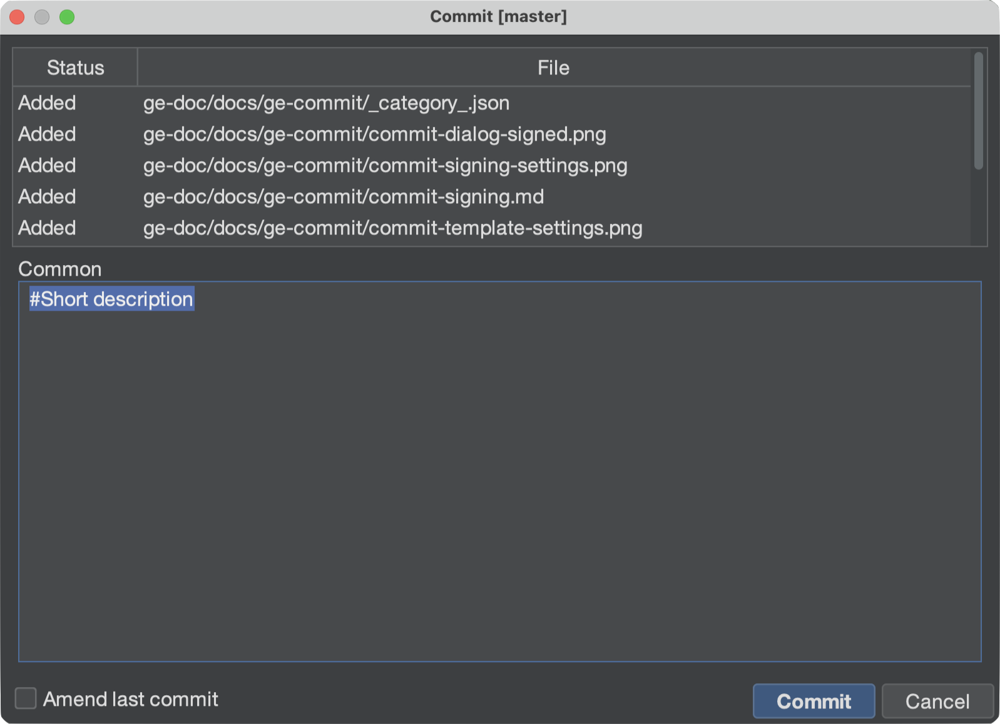

# Commit message template

Gitember can pre-fill the commit dialog with a message template — a subject line, a
checklist, a ticket prefix, and so on.

:::info AI generation takes precedence
The template is applied **only when AI commit message generation is off**.
If **File → Settings → AI → Enable commit message generation** is checked, Gitember asks
the local Ollama model for a message and does **not** insert the template.
:::

## Configuring the template

1. Open **File → Settings**.
2. Open the **Commit** tab.
3. Type (or paste) the template text.
4. Click **OK**.

Leave the field empty to fall back to Git's own `commit.template` (local repository config
first, then `~/.gitconfig`). **Load from git commit.template…** copies that file into the
Gitember field so you can edit it without leaving the app.




## When it is used

The commit dialog fills the message from the template when **all** of the following are true:

1. **Enable commit message generation** (Settings → AI) is **off**.
2. The message field is still empty.
3. A template exists — Gitember's Settings text, or else `commit.template` from Git.

If AI generation is on, the dialog shows a generated suggestion instead. Turn that option
off if you want the static template back.




## Example

```text
# Ticket:

# Why:

# Notes:
```

Lines that start with `#` are a reminder while you type; trim them before you commit if you
do not want them in history.

## Summary

| Setting | Effect on the commit message |
|---------|------------------------------|
| AI commit message generation **on** | Local LLM suggestion; template is skipped. |
| AI generation **off**, Gitember template set | That text is pre-filled. |
| AI generation **off**, Gitember template empty | Git `commit.template` is used if configured. |
| Both empty | The message field starts blank. |
