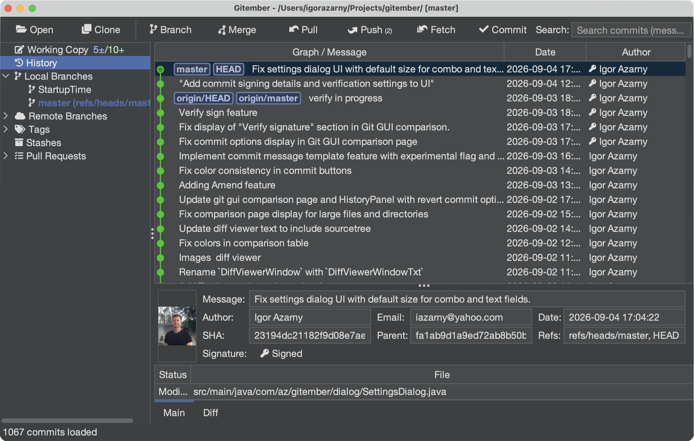
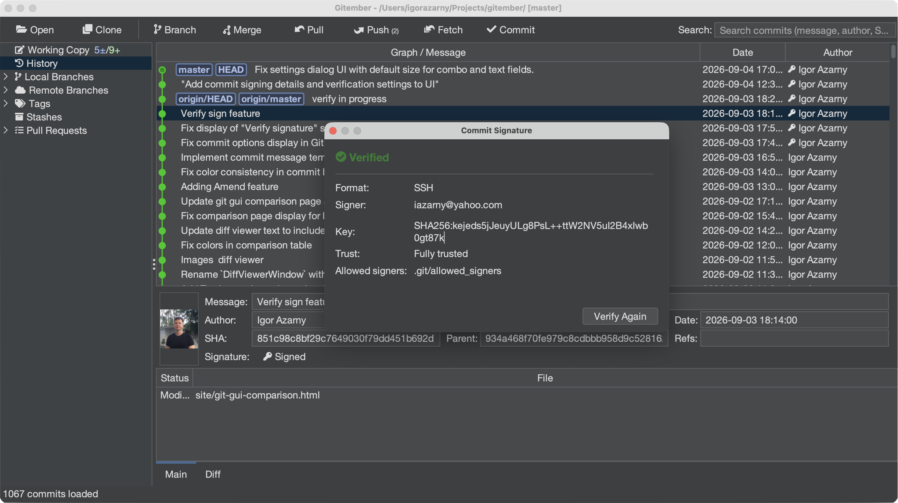

# Verifying signatures

Gitember can check **SSH** and **GPG (OpenPGP)** signatures on commits. History is **not**
verified while it loads — Gitember only records whether a commit carries a signature.
Cryptographic verification runs **on demand**, when you open the signature dialog.

```
Git object (commit)
        │
        ├── no signature  →  Unsigned  (no icon)
        └── has signature →  Signed
                                │
                     user clicks the icon
                                │
                         SignatureVerifier
                                │
                   ┌────────────┼────────────┐
                   │            │            │
              Verified      Invalid      Unknown
```

## Turning verification on

1. Open **File → Settings → Commit Signing**.
2. Check **Verify commit signatures**.
3. Choose where allowed signers are read from (SSH only):
   - **`~/.ssh/allowed_signers`** — one file for all repositories on this machine.
   - **`.git/allowed_signers`** — a file inside the current repository.
4. Click **OK**.

When the global file is selected, **Edit…** opens `~/.ssh/allowed_signers` and
**Edit revoked keys…** opens `~/.ssh/revoked_keys`.

When the repository file is selected, **Project Settings** grows an
**Edit .git/allowed_signers…** button.

:::note Screenshot placeholder
Add `commit-verify-settings.png` here (the Verification block: checkbox, the two allowed-signers
radios, and the Edit / Edit revoked keys buttons).
:::

TODO  commit-verify-settings.png

GPG signatures are verified against your local OpenPGP keyring. The allowed-signers file is
used for **SSH** signatures.

## Allowed signers file format

:::caution Do not paste a `.pub` file as-is
The `allowed_signers` record is **not** the same as an SSH public-key (`.pub`) file.
A `.pub` line starts with the key type. An allowed-signers line **must start with the
principal** (usually the committer email) and, for Git, should include `namespaces="git"`.
:::

A typical **`id_ed25519.pub`** (what `ssh-keygen` writes, and what Gitember's signing
setting points at) looks like:

```text
ssh-ed25519 AAAAC3NzaC1lZDI1NTE5AAAAIExampleKeyMaterialHere igor@laptop
```

The last token is only a comment. Git does **not** treat it as the signer identity.

An **`allowed_signers`** line for the same key looks like:

```text
igor@example.com namespaces="git" ssh-ed25519 AAAAC3NzaC1lZDI1NTE5AAAAIExampleKeyMaterialHere
```

| Field | `.pub` file | `allowed_signers` |
|-------|-------------|-------------------|
| First token | Key type (`ssh-ed25519`, `ssh-rsa`, …) | **Principal** — email or identity Git should accept |
| Git namespace | Not used | **`namespaces="git"`** — required, Git SSH signatures use the `git` namespace |
| Key type + base64 | Present | Present, after the principal and options |
| Comment | Optional trailing comment | Optional; not used as the principal |

Copy the key type and the base64 blob from the `.pub` file, then **prefix** the principal and
`namespaces="git"`. If you drop a raw `.pub` line into `allowed_signers`, verification will
fail even though the key itself is correct.

Several principals can share one key (comma-separated):

```text
igor@example.com,igor@company.com namespaces="git" ssh-ed25519 AAAAC3NzaC1lZDI1NTE5AAAAIExampleKeyMaterialHere
```

One identity can also have several keys, each on its own line.


### Revoked keys

`~/.ssh/revoked_keys` lists SSH keys that must no longer verify. Gitember passes this file to
JGit as `gpg.ssh.revocationFile` when it exists. The format is OpenSSH's revocation list
(plain public keys or a binary KRL), not an `allowed_signers` file and not a `.pub` comment
line.

## Seeing signed commits in History

Signed commits show a **key icon** in the **Author** column. Unsigned commits have no icon.
The icon means “this commit has a signature”, not “it is trusted”.

Click the icon to open the signature dialog and run verification.

:::note Screenshot placeholder
Add `history-signed-author.png` here (History table, Author column, key icon on a signed commit).
:::



## Commit detail and the signature dialog

Select a signed commit. The detail pane adds a **Signature** row (hidden for unsigned
commits). Click it to open the same non-modal dialog.

The dialog shows:

- Status: **Verified**, **Invalid**, **Unknown**, or **Signed** (verification off)
- **Format** — SSH or GPG
- **Signer**
- **Key** fingerprint
- **Trust** (for example Fully trusted)
- **Allowed signers** — `~/.ssh/allowed_signers` or `.git/allowed_signers`
- **Verify Again**

:::note Screenshot placeholder
Add `commit-signature-dialog.png` here (the Commit Signature dialog: Verified, Format SSH,
Signer, Key, Trust, Allowed signers, Verify Again).
:::



| Status | Meaning |
|--------|---------|
| Signed | A signature is present; it has not been checked yet, or verification is turned off in Settings. |
| Verified | The signature matches an allowed SSH signer or a trusted GPG key. |
| Invalid | The signature is present but does not check out (wrong key, revoked key, bad payload). |
| Unknown | The format has no verifier, or verification could not complete. |

## Summary

- Turn on **Verify commit signatures** under **Settings → Commit Signing**.
- SSH trusted keys go in `allowed_signers` — **not** a copy of a `.pub` file.
- History only flags signed commits; click the icon (or the detail-pane Signature row) to verify.
- Use **Verify Again** after you edit `allowed_signers` or `revoked_keys`.
