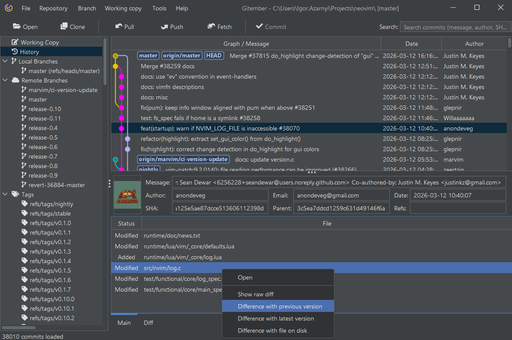
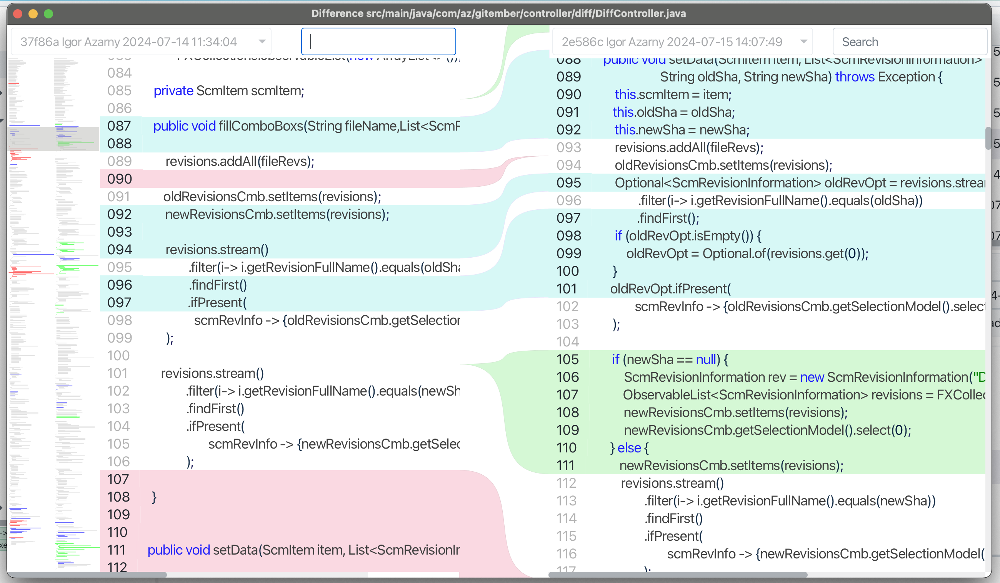

# Difference between files

Gitember provides robust functionality to view file differences, allowing you to compare 
changes in your working copy, between different commits, and more. 
This can be especially useful for code reviews,  and understanding changes in detail.

## Viewing Differences in the Working Copy

 * Locate the changed file you want to compare.
 * Double-click on the changed file to open the diff view.
 * Gitember will display the differences between the current working copy of the file and the last committed version.

## Viewing Differences from a Commit

 * Locate the commit you want to compare.
 * In the commit details view, find the file you want to compare.
 * Right-click on the file and choose Show Diff from the context menu.
 * Gitember will display options to compare in context menu
   * Difference with latest version
   * Previous version 
   * With disk version

It is also possible to show difference as patch. 

## Features
Difference is shown as  side-by-side diffs with highlighted changes - 
Added, removed, and modified lines are highlighted to show exactly what has changed.