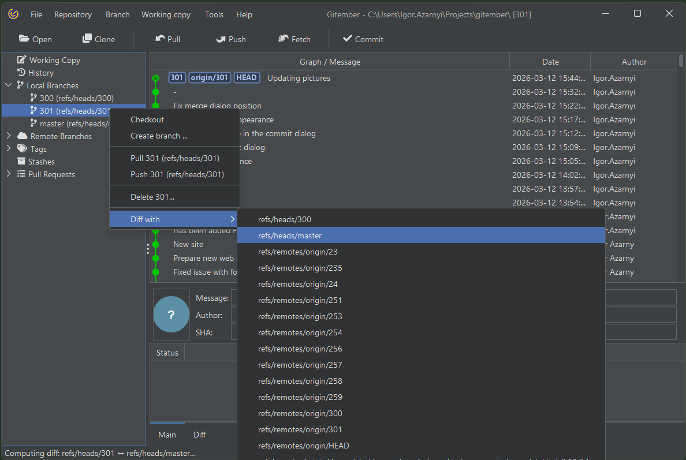
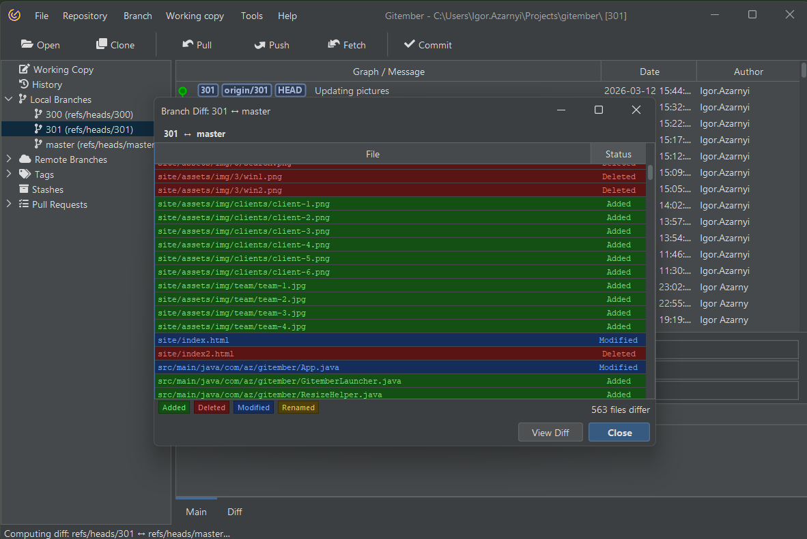

# Difference between files

Gitember provides a useful feature to show differences between branches, which helps in understanding the scope of changes and preparing for merges or reviews. 
This functionality can be accessed easily through the branch context menu.

 
 * Go to the 'Branch' tab on the main toolbar to see the list of branches in your project.
 * Use branch context menu of source branch
 * Select the target branch to show the differences

Gitember will open a separate window displaying the differences between the two branches.
In this window, you will see the changes categorized as added, removed, and changed files.

For changed files use context menu to see file difference