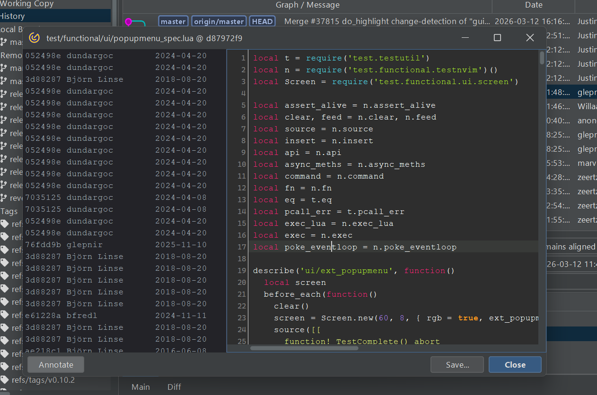
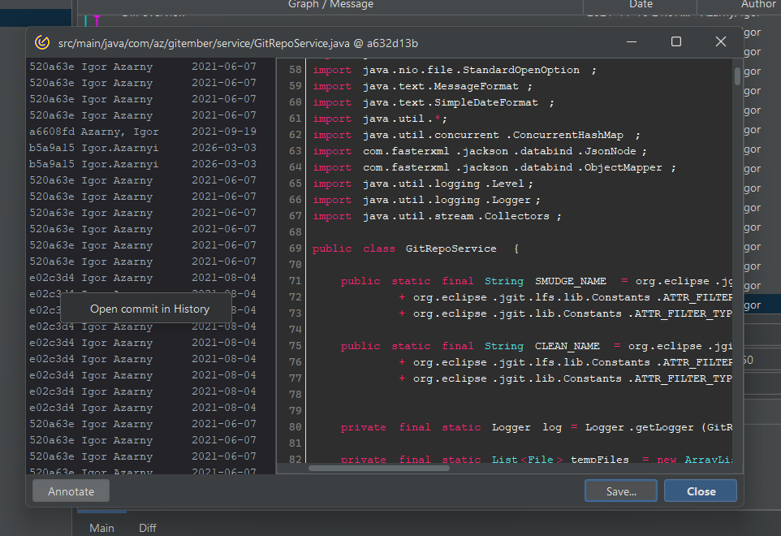

# File Blame (Annotation)

The Blame view (also called Annotation) shows, for every line in a file, which commit last changed that line and who authored it. This makes it easy to trace when and why a specific line of code was introduced.

See also [git-blame](https://git-scm.com/docs/git-blame) in Git documentation.

## Reading the Blame View

The Blame view displays the file content with an annotation column on the left of each line showing:

| Column | Description |
|--------|-------------|
| **SHA** | Abbreviated commit hash that last modified this line. |
| **Author** | Name of the person who authored that commit. |
| **Date** | Date of the commit. |
| **Line** | The actual source line. |

Lines that belong to the same commit are grouped by a shared background colour, making it easy to see which block of lines came from the same change.

## Navigating to a Commit

Click any annotated line to highlight all lines belonging to the same commit. The commit details 
(message, author, date, full SHA) are displayed in the panel below the annotated file.

Double-click an annotated line to jump directly to that commit in the **History** view.

## Summary

| Action | How to trigger |
|--------|---------------|
| Open blame for a working-copy file | Working Copy → right-click file → **Blame** |
| Open blame from a commit | History details → right-click file → **Blame** |
| View commit details | Click any line in the blame view |
| Navigate to commit in history | Double-click a line in the blame view |
