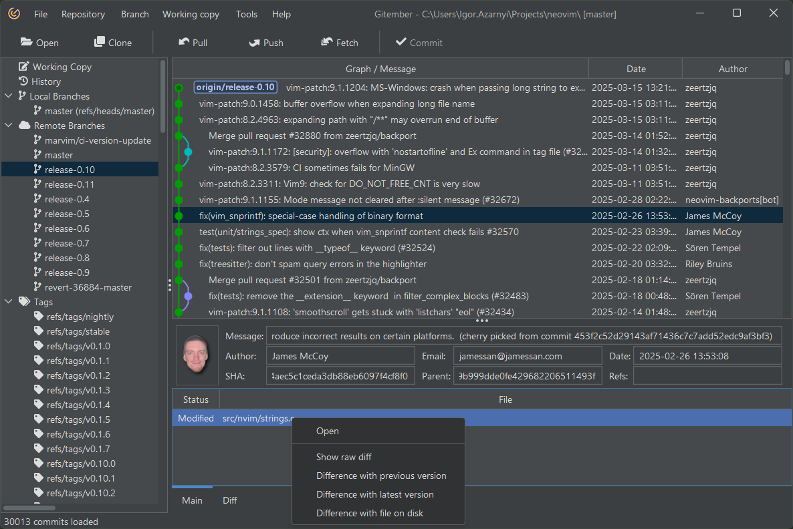

# History of branches

Similar to the history of commits, the history of branches provides a visual representation of the branching 
structure in your project. It allows you to view changes, that impact selected branch.

The set of action, which you can perform with item in branches, is similar to the set of actions with regual history.
to track and manage changes in your project.

