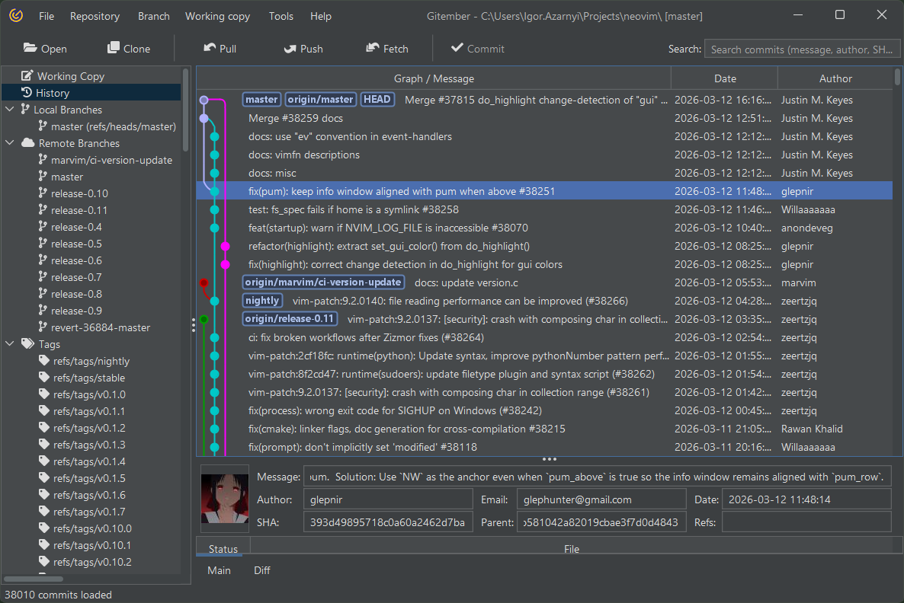
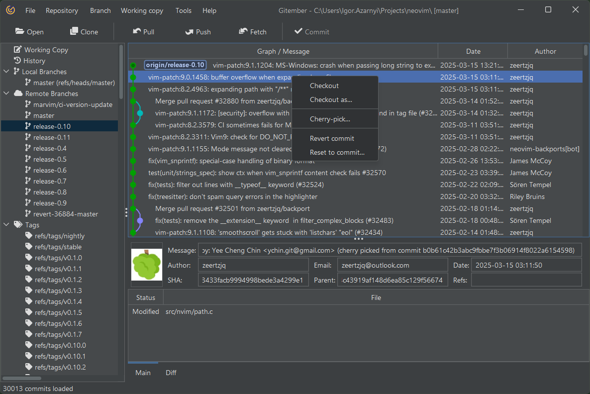
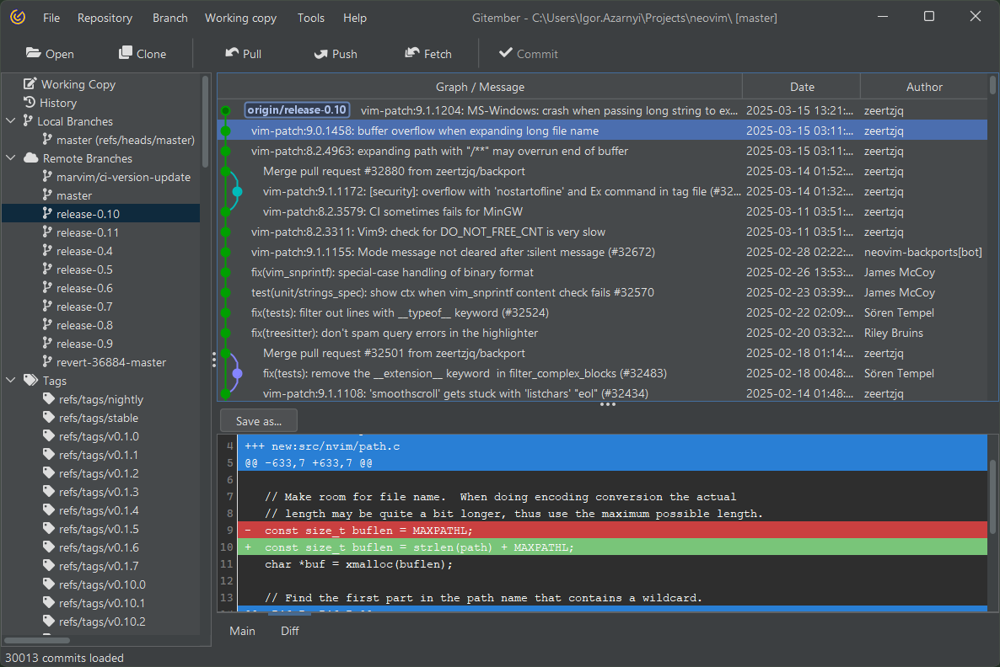

# History

The project history functionality in Gitember provides a comprehensive 
view of your project's commit history, including merges, branches, and individual 
commits. It allows you to perform various operations on commits and view detailed 
information about each commit.

# Overview of Project History

## Accessing Project History

 * Open Your Project: First, open your project in Gitember.
 * Navigate to the History Tab: Go to the main toolbar and select the 'History' tab.

## History Visualization

 * The history view displays a graphical representation of your commit history, including branches and merges.
 * Each commit is represented by a node, with lines connecting related commits to illustrate the branching structure.

## Operations You Can Perform with Commits

  * View Commit Details: Click on a commit node to view detailed information about the commit.
  * Checkout a Commit: Right-click on a commit node and select 'Checkout' to switch to that commit.
  * Create a Branch: Right-click on a commit node and select 'Create Branch' to create a new branch from that commit.
  * Merge Branches: Right-click on a commit node and select 'Merge' to merge branches.
  * Revert a Commit: Right-click on a commit node and select 'Revert' to undo changes introduced by that commit. Choose between different reset types:
    *  Soft Reset: Moves the HEAD to the selected commit, keeping the working directory and index intact.
    * Mixed Reset: Moves the HEAD to the selected commit and updates the index, but not the working directory.
    * Hard Reset: Moves the HEAD to the selected commit and updates both the index and the working directory.
  * Reset HEAD to Commit: Right-click on a commit node and select 'Reset to Commit' to move the HEAD pointer to that commit. 
  * Cherry-Pick a Commit: Right-click on a commit node and select 'Cherry-Pick' to apply changes from that commit to the current branch.

## Observing Commit Details

 * Click on a commit in the history view to display its details in the details pane.
 * Main Details tab include:
   * SHA: The unique identifier of the commit.
   * Author and Committer: Names and email addresses of the author and the committer.
   * Date: The date and time when the commit was made.
   * Message: The commit message describing the changes.
   * References: Branches or tags pointing to the commit.
   * The details pane also lists the files changed in the commit, along with their status (modified, added, deleted).

* Raw tab include:
    * The diff view shows line-by-line changes, with additions highlighted in green and deletions in red.

## Summary

Gitember’s project history functionality provides a powerful interface for visualizing and 
managing your project's commit history. You can easily observe commits, branches, and merges, 
and perform various operations on commits, such as checkout, cherry-pick, revert, and reset. 
Additionally, you can view detailed information about each commit, including raw 
differences with the previous commit, making it easier to track and manage changes in your project.