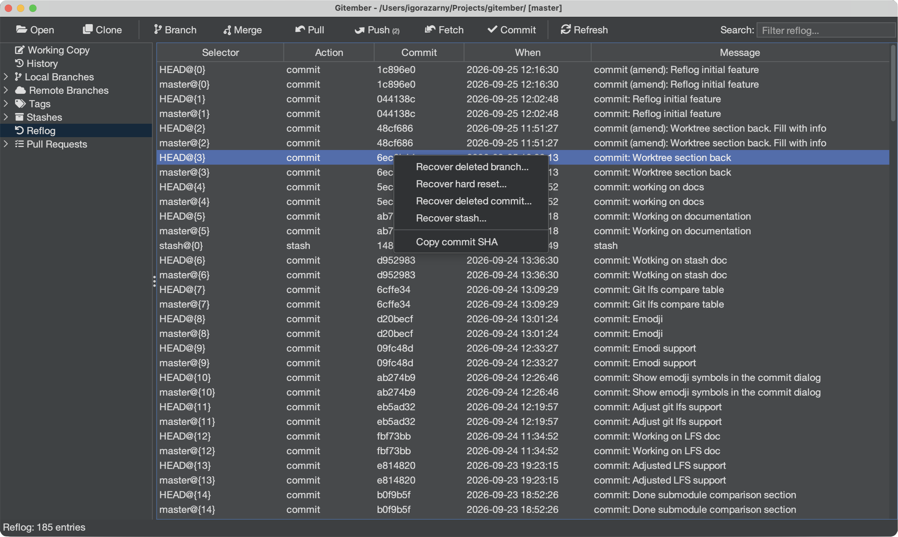

# Reflog

The reflog is Git’s local safety log: every time `HEAD`, a branch, or the stash moves, Gitember records that line. You can use it to recover work after a deleted branch, a hard reset, a rewritten commit, or a dropped stash.

See also [Git reflog](https://git-scm.com/docs/git-reflog) in the Git documentation.

## Opening the Reflog view

In the repository tree, **Reflog** sits directly under **Stashes**. Click it to load every entry from `HEAD`, local branches, and `refs/stash`.

| Column | Description |
|--------|-------------|
| **Selector** | `HEAD@{n}`, `branch@{n}`, or `stash@{n}` |
| **Action** | Classified kind: commit, checkout, reset, stash, … |
| **Commit** | Short SHA after the movement |
| **When** | Time of the reflog line |
| **Message** | Git’s reflog comment (`reset: moving to …`, `checkout: moving from …`) |

Use the filter box to search by selector, SHA, kind, or message.

## Recover deleted branch

After `git branch -D` (or Gitember’s delete), the last tip is still in the reflog.

1. Select the checkout or commit line that still names the branch (often `checkout: moving from my-branch to …`).
2. Right-click **Recover deleted branch…**
3. Confirm or edit the branch name. Gitember creates that local branch at the recovered SHA.

TODO reflog-recover-branch.png

## Recover hard reset

A hard reset moves `HEAD` and the working tree. The previous tip is the **old** SHA on the `reset:` line.

1. Select the `reset:` entry.
2. Right-click **Recover hard reset…**
3. Confirm. Gitember hard-resets back to the SHA from before that reset.

Uncommitted work in the working tree is discarded.

## Recover deleted commit

Amend, rebase, or reset can leave a commit without a branch. The commit object is still in the reflog.

1. Select the line whose **Commit** SHA you want back.
2. Right-click **Recover deleted commit…**
3. Enter a new branch name. Gitember points that branch at the commit.

## Recover stash

A dropped stash commit can be put back on the stash stack (`git stash store`).

1. Select a `stash@{n}` line, or any line whose commit is the stash object.
2. Right-click **Recover stash…**
3. The stash list in the tree updates; apply it from **Stashes** as usual.

## Summary

| Action | How to trigger |
|--------|----------------|
| Open reflog | Tree → **Reflog** (below Stashes) |
| Recover deleted branch | Right-click → **Recover deleted branch…** |
| Recover hard reset | Right-click → **Recover hard reset…** |
| Recover deleted commit | Right-click → **Recover deleted commit…** |
| Recover stash | Right-click → **Recover stash…** |
