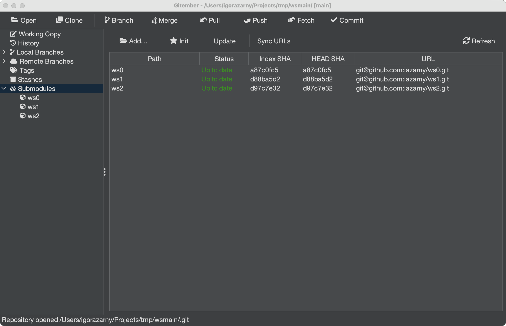

# Submodules

Git submodules allow you to embed one Git repository inside another as a subdirectory while keeping their histories separate. They are commonly used to include shared libraries or third-party dependencies directly in a project.

See also [Git Submodules](https://git-scm.com/book/en/v2/Git-Tools-Submodules) in Git documentation.

## Viewing Submodules

When you open a repository that contains submodules, they are listed in the **Submodules** section of the Branches panel.

Each entry shows:

| Column | Description |
|--------|-------------|
| **Name** | The path of the submodule inside the parent repository. |
| **URL** | The remote URL the submodule points to. |
| **SHA** | The commit SHA the parent repository currently has checked out for the submodule. |

## Adding a Submodule

1. Open **Repository → Submodules → Add Submodule…**, or click **Add…** on the Submodules panel.
2. Enter the remote URL and the path inside this repository (for example `libs/shared`).
3. Gitember clones the repository, writes `.gitmodules`, and stages the gitlink.
4. Use **Commit submodule change…** (or a normal commit) to record the new submodule.

## Initializing and Updating

After cloning a repository or after a pull that changed the recorded submodule commit, the submodule directories may be empty or out of date.

| Action | What it runs |
|--------|----------------|
| **Initialize Submodules** | `git submodule init` — copies URLs from `.gitmodules` into `.git/config` |
| **Update Submodules** | `git submodule init` then `git submodule update` |
| **Recursive Update** | The same update, then repeats it inside each checked-out submodule |

Progress is shown in the status bar. Right-click a single row to initialize or update only that path.

## Synchronising Submodule URLs

If the remote URL of a submodule has changed in `.gitmodules`, you need to synchronise the recorded URL before updating:

1. Open the **Repository** menu.
2. Select **Sync Submodules**.

This propagates the new URL from `.gitmodules` into each submodule's local configuration.

## Opening a Submodule

To work inside a submodule as if it were a standalone repository:

1. Double-click the submodule entry in the **Submodules** panel, or right-click **Open**.
2. Gitember opens the submodule as its own repository.

The working tree must already be initialized and updated.

## Commit, Diff, Status, and Remove

Right-click a submodule in the table or the tree:

- **Commit submodule change…** — stages the gitlink (and `.gitmodules` if needed) and commits only those paths.
- **Show diff** — gitlink diff between the parent index SHA and the submodule `HEAD`.
- **Show status** — path, URL, status, and both SHAs.
- **Remove…** / **Remove (force)** — `git submodule deinit` plus `git rm`, then deletes `.git/modules/<path>`. Force discards local changes inside the submodule.

## Summary

| Action | How to trigger |
|--------|---------------|
| View submodules | Branches panel → **Submodules** section |
| Add a submodule | Repository → Submodules → **Add Submodule…** |
| Initialise submodules | Repository → Submodules → **Initialize Submodules** |
| Update submodules | Repository → Submodules → **Update Submodules** |
| Recursive update | Repository → Submodules → **Recursive Update** |
| Sync changed remote URLs | Repository → Submodules → **Sync Submodule URLs** |
| Commit / diff / status / remove | Right-click a submodule row |
| Open submodule as standalone repo | Double-click submodule entry |
