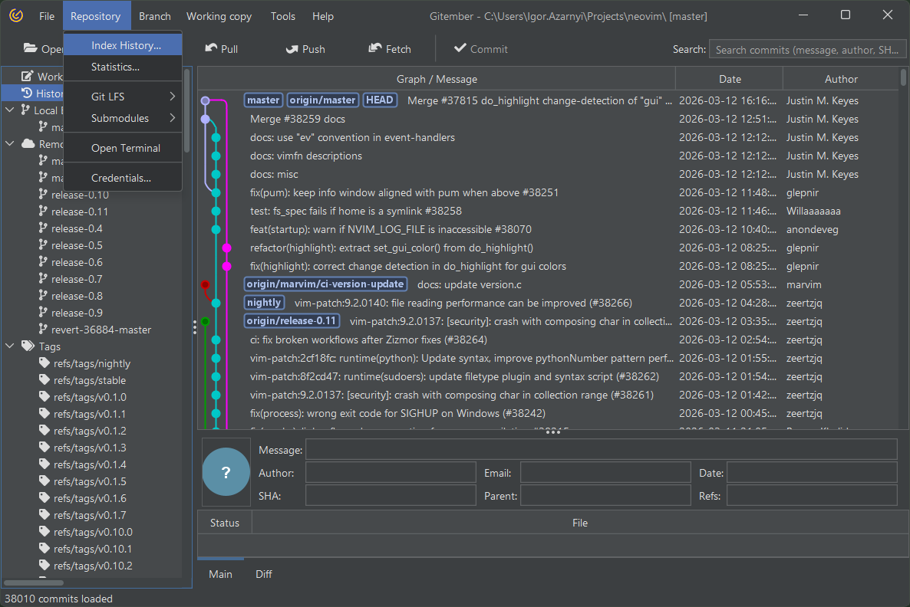

# Extended Search

The Extended Search provides the ability to search across the commit metadata and *contents of documents*, 
including the body of files such as Office documents, CAD files, Archive, Audio and more.

##  Indexing repository

 * Before using Extended Search, you need to index the files in your repository.
 * Open the *Repo* menu and navigate to *Settings*.
 * Select *Index History*
 * Provide the history size (number of commits) you want to index

   Gitember will index the files based on the specified history size, making their contents searchable.

## Search

 * Start typing your search phrase (e.g., a specific commit message, SHA, file name, *or part of body or meta info*).
 * Gitember will highlight all commits that match the search term.

### Supported File Formats

List of  [supported formats](https://tika.apache.org/1.10/formats.html)

