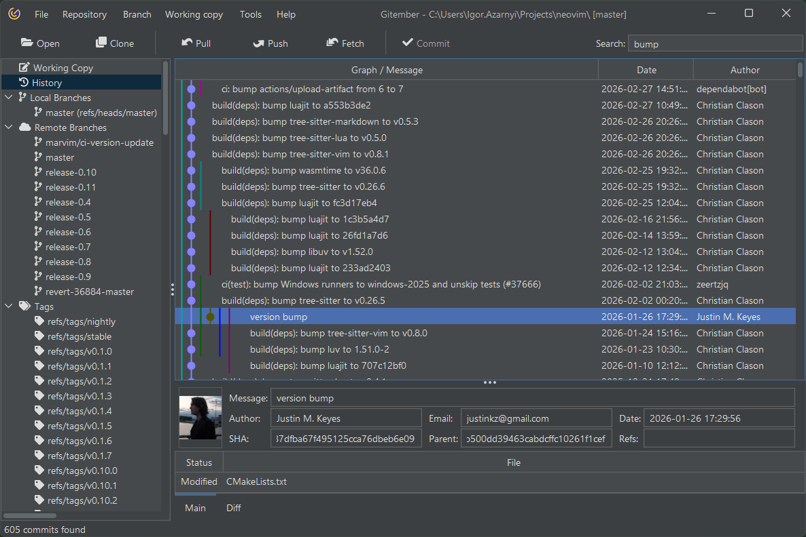

# Regular Search

The Regular Search is designed to search through commit metadata, 
including commit messages, SHAs, and changed files.

# Perform the Search

 * Start typing your search phrase (e.g., a specific commit message, SHA, or file name).
 * Gitember will highlight all commits that match the search term.

