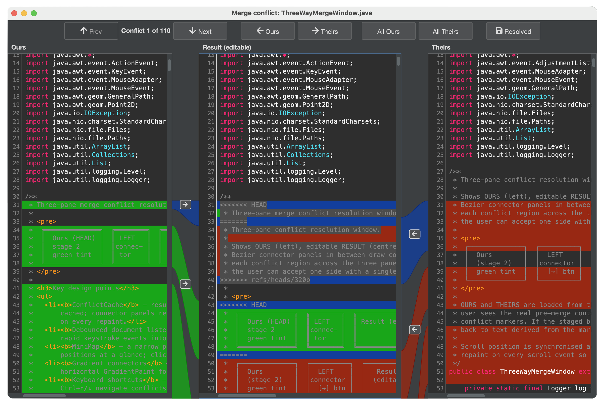

# Three-Way Conflict Resolution

When a merge or pull results in conflicting changes, Gitember provides a built-in
three-way merge editor that lets you review and resolve each conflict visually —
without leaving the application.

## Opening the Editor

1. In the **Working Copy** tab, conflicted files are marked with a conflict icon.
2. Right-click the conflicted file and choose **Resolve conflict** from the context menu.
3. The three-way merge editor opens automatically.

## Layout

The editor is divided into three panes:

| Pane | Content |
|------|---------|
| **Ours** (left) | Your local changes — the version on the current branch. |
| **Result** (centre) | The editable merge result that will be saved. |
| **Theirs** (right) | Incoming changes — the version being merged in. |

The connector panels between the panes highlight each conflicting block and draw
curved lines connecting the corresponding regions in the adjacent panes.

## Accepting Changes

Each conflict block has an arrow button in the connector panel:

* Click **→** (Ours → Result) to accept your local change for that block.
* Click **←** (Theirs → Result) to accept the incoming change for that block.

You can also edit the **Result** pane directly to craft a custom resolution.

Use **Prev** and **Next** to navigate between conflict blocks.

## Saving the Resolution

When all conflicts are resolved, click **Resolved** to save the file and mark it
as resolved in Git.  The file is removed from the conflicted state in the
Working Copy tab and is ready to be staged and committed.

## Tips

* You can accept changes block-by-block, mixing Ours and Theirs as needed.
* The Result pane is a full editor — you can type or paste any content.
* Use **All Ours** or **All Theirs** toolbar buttons to accept all blocks at once
  when one side is entirely correct.
