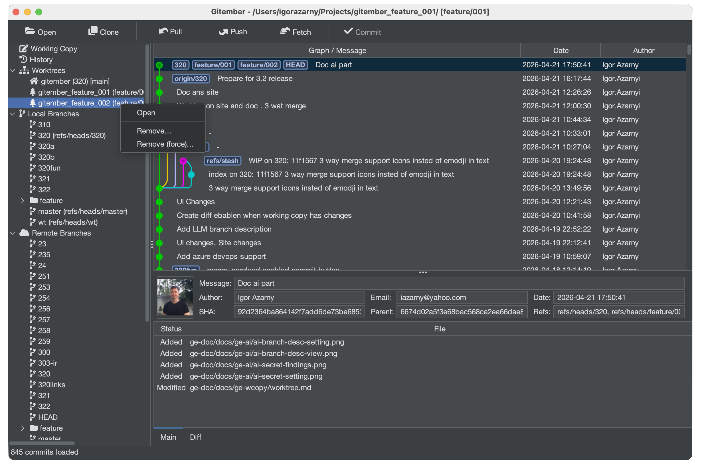
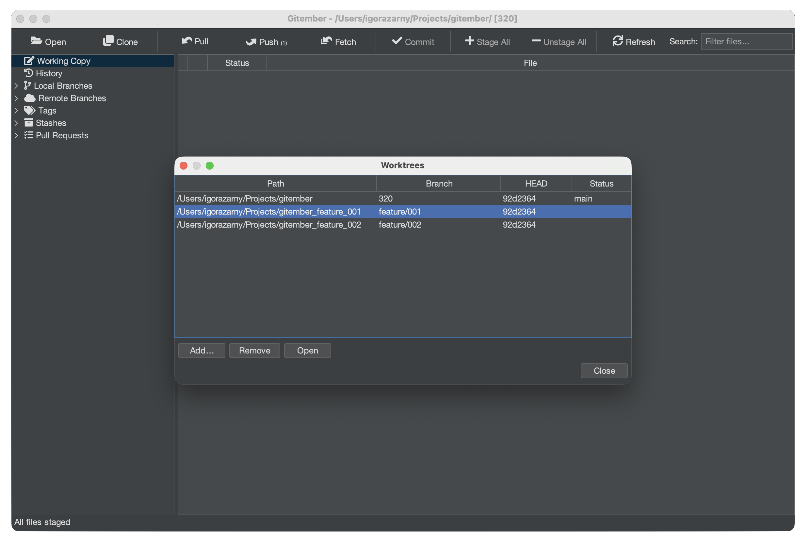

# Worktrees

Git worktrees let you check out more than one branch at the same time, each in its own
directory. Instead of stashing or committing half-finished work just to switch context,
you can have a separate working directory per task — all sharing the same repository
and object store.

See also [git worktree](https://git-scm.com/docs/git-worktree) in the Git documentation.

## Opening the Worktree Manager

Go to **Working copy → Worktrees…** in the menu bar.

The dialog lists every linked worktree alongside its path, checked-out branch, and status.

## Adding a Worktree

1. Click **Add** in the Worktree manager.
2. Enter (or browse for) the **directory** where the new worktree should be created.
3. Choose the **branch** to check out in that directory.  
   You can also create a new branch at this point.
4. Click **OK**.

Gitember runs `git worktree add` in the background. The new directory appears in the
list and is immediately usable — open it as a separate project or navigate to it in
your file manager.

:::tip
Keep worktree directories beside the main repo folder and use a consistent naming
convention, e.g. `my-repo`, `my-repo-hotfix`, `my-repo-experiment`.
:::

## Removing a Worktree

1. Select the worktree entry you want to remove.
2. Click **Remove**.

Gitember runs `git worktree remove`, which deletes the linked directory and prunes the
worktree reference from the repository.

:::note
A worktree can only be removed when it has no uncommitted changes. Clean the working
directory first (commit, stash, or discard) before removing.
:::

## Worktree Constraints

| Rule | Detail |
|------|--------|
| One branch per worktree | The same branch cannot be checked out in two worktrees simultaneously. |
| Shared object store | All worktrees share commits, tags, and refs — no duplication. |
| Independent index | Each worktree has its own staging area and HEAD. |

## Summary

| Action | How to trigger |
|--------|---------------|
| Open manager | **Working copy → Worktrees…** |
| Add worktree | Worktree manager → **Add** |
| Remove worktree | Worktree manager → select entry → **Remove** |
