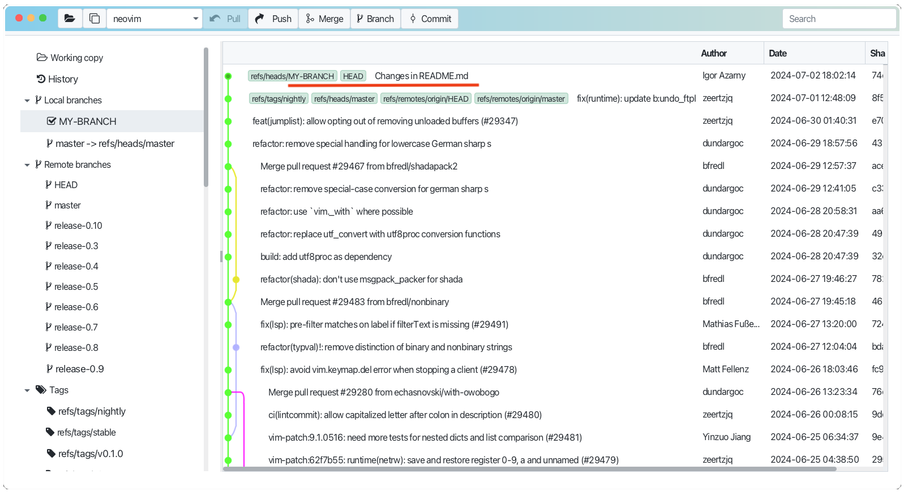

# Commit changes in branch

It is easy to mark item in the working copy tab as staged and press the commit button from menu bar. 
You will see the dialog, where you can provide commit message and commit changes.

Your commited changes will be reflected in branch history.

See [Working copy](../ge-wcopy/wcopy.md) for more details.

See also [Committing Changes](https://git-scm.com/book/en/v2/Git-Basics-Recording-Changes-to-the-Repository) in Git documentation.