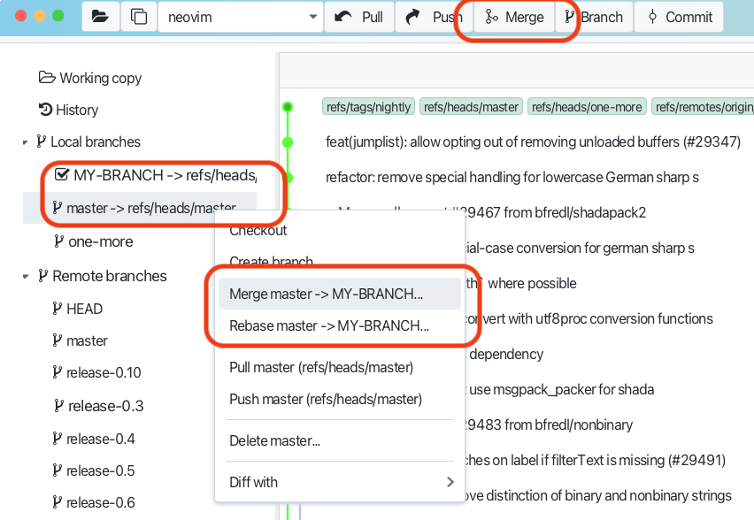
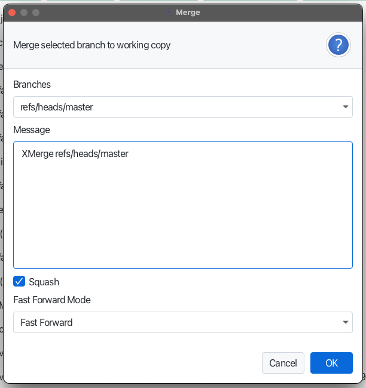

# Merging Branches

Merging branches involves integrating changes from one branch into another. This process helps incorporate feature 
development, bug fixes, or other updates into a main branch or another target branch.

Select target branch, which you want to merge into current, and click on the "Merge" button in the toolbar or 
merge selected branch in to current from context menu.

You will be promted to provide merge options - strategy , message and squash option.

See also [Merging Branches](https://git-scm.com/book/en/v2/Git-Branching-Basic-Branching-and-Merging) in Git documentation.
