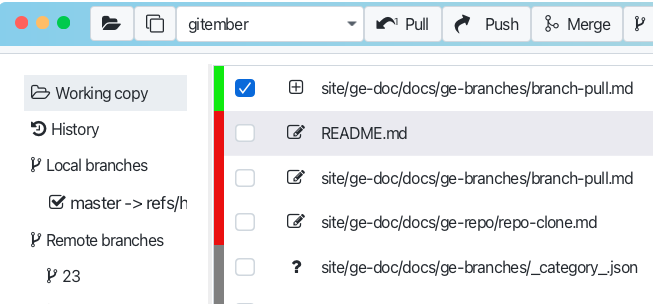
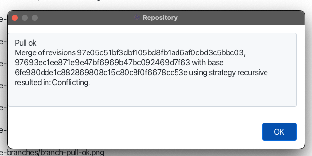

# Pulling a Branch with Conflicts

Conflicts occur when Git is unable to automatically merge changes because the same lines in the same 
files have been modified differently in the local and remote branches.
So possible two options:
 * update local branch with uncommited changes 
 * update local branch with commited  changes

## Pull remote with local uncommitted changes.
When you pull a branch with uncommitted changes, Git will attempt to merge the changes from the remote.

If it not possible to merge changes, Git will display a conflict message in the output window.

And the same time you will see the that remote branch ahead of your branch at the tool bar pull button. 
It mean , that branch is fetched locally, but not update you working copy.

## Pull remote with local uncommitted changes.
When you pull a branch with committed changes possible that some files will be in conflict state. In this case 
you will see the conflict message in the output window.

Is this case files in the working copy will be marked as conflicted. You can observe conflicted files int the workingcopy tab.

### Understanding Conflict Markers

When a conflict occurs, Git places conflict markers in the affected files to indicate the differences 
between the conflicting changes. You can see the conflict markers in the file.

 * \<\<\<\<\<\<\< Indicates the start of the changes in your local branch.
 * =======: Separates your changes from the incoming changes.
 * \>\>\>\>\>\>\> branch-name: Indicates the end of the changes from the remote branch named branch-name.
 

## Resolving Conflicts

Just click on the file with conflicts in the working copy tab. You will see the conflict markers in the file.
Right click on the file and choose "Resolve conflicts" from the context menu. Chose the way how to resolve 
conflicts and press "Resolve" button.

