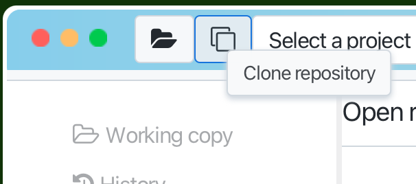

# Clone repository

Cloning a repository means creating a local copy of a project that exists in a
remote repository. Gitember simplifies this process with an interactive approach.
To clone a repository using Gitember, run clone command via menu Repo -> Clone or tool bar button.

When you run the gitember clone command, 
Gitember will guide you through the process with the following prompts:
 
* Enter the Remote Repository URL, for example https://github.com/iazarny/gitember.git
* Specify the Destination Folder, just typing it or select

|SSH| HTTP                                 |
|---|--------------------------------------|
||  |

## Cloning repository via http protocol 

If you are cloning a repository via the HTTP protocol, you might need to 
provide authentication details if the repository is private. You will be prompted 
to enter your username and password. 
If the repository is public, you can skip these values.

If the repository is protected and requires authentication, but you did not provide the username 
and password initially, you will be prompted to enter these details during the checkout process.

