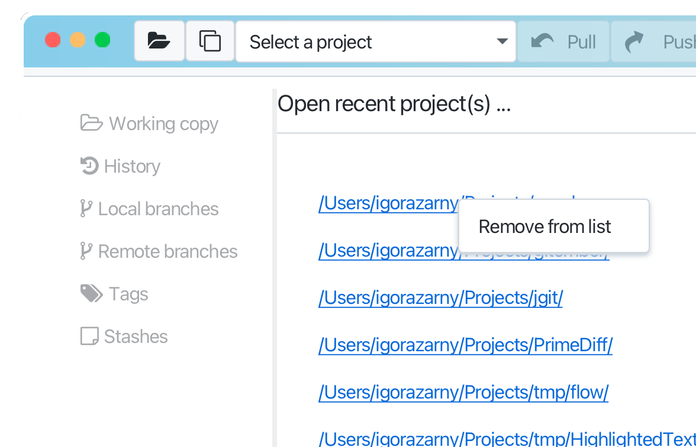

# Open repository

If you have already cloned a repository and want to open it again in Gitember, 
you can easily do so using the Gitember interface. Opening a previously cloned repository 
in Gitember is straightforward. You can use the "Repo" menu to select "Open ..." or click 
the 'Open Project' button on the tool bar. 
Navigate to your project folder, select it, and Gitember will load the project, 
making it ready for you to continue working.

Gitember makes it easy to manage your projects by providing multiple ways to quickly 
reopen projects that you have worked on before. Whether you cloned a repository or opened 
a project previously, you can swiftly access your projects through various convenient methods.

* Via the Menu
* Via the Project Selector on the Toolbar
* Via the List of Recent Projects

Gitember provides an easy way to manage your list of recent projects. If you have projects that you no longer need quick 
access to, you can easily remove them from the recent projects list.

* Win Find the project you want to remove from the list. Right-click on the project name.
* Mac Find the project you want to remove from the list. Hold down the Control key and click on the project name.

A context menu will appear. Click on the option labeled Remove from Recent Projects.

