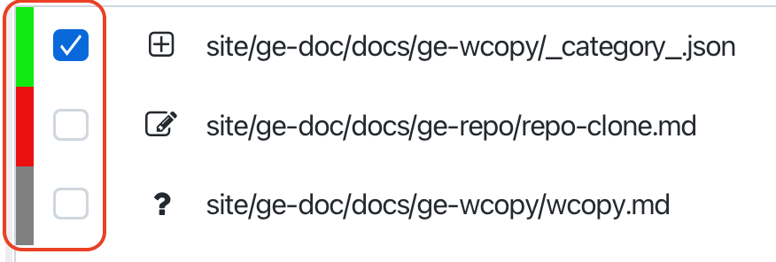

# Working copy

The Git Working Copy page in Gitember is the main interface where you can 
observe and manage the latest changes in your working copy. T
his page provides a visual representation of the current state of your project’s files, 
similar to what you would see when using the git status command in the terminal.

## Changes Overview

* Modified Files: Files that have been modified since the last commit.
* Added Files: New files that have been added to the staging area.
* Deleted Files: Files that have been deleted from the working directory.
* Untracked Files: New files in the working directory that have not been staged for commit.
* Confliected Files: Files that have conflict with remote repo files.

## File Status Icons

Each file in the list will have an icon indicating its status (e.g., modified, added, deleted, untracked).
And sate / unstage mark

## Context menu

Each file in the list will have a context menu that allows you to perform various actions on the file, such as:
 * staging and unstaging
 * discarding changes
 * viewing file diff 
 * opening file in editor
 * deleting file
 * viewing file history
 * resolving conflicts

### Stage and Unstage Changes

To stage / unstage changes, just click the combobox on the left side of the file. 

In case if file has been staged bit not commited yet, you can unstage it by clicking the combobox again.

Also posible, that file may be presented in the list two times: 
 * marked as staged 
 * marked as changed
It is possible that some file can be marked twice: as staged and as changed.

